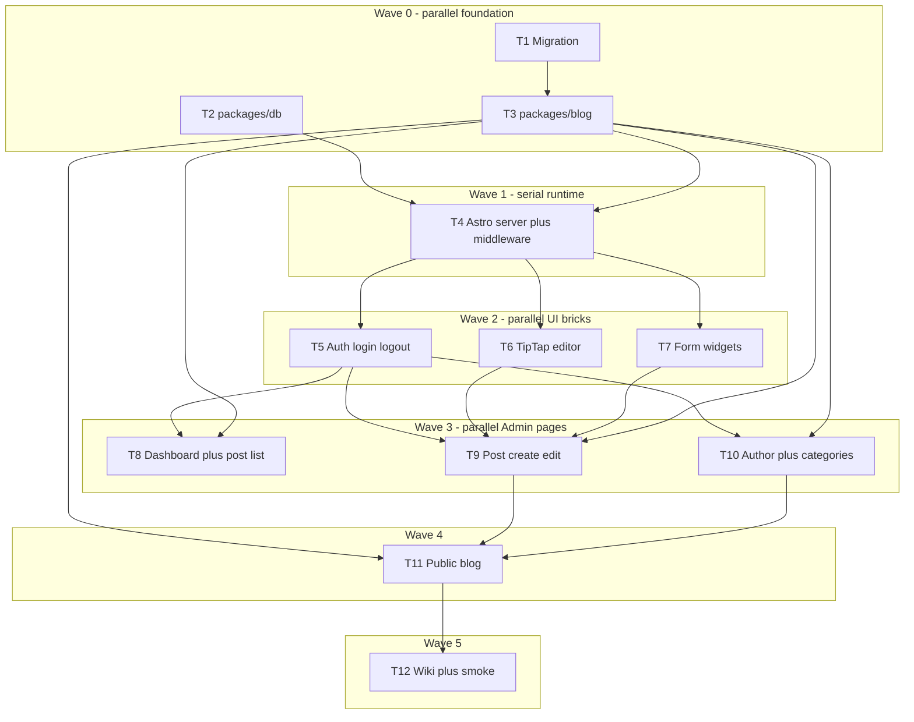

# CAE Admin Blog — sub-agent task split

**Source plan:** [cae_admin_blog_041fbce8.plan.md](../../.cursor/plans/cae_admin_blog_041fbce8.plan.md) (or `C:\Users\Asus\.cursor\plans\cae_admin_blog_041fbce8.plan.md`)  
**Domain language:** [`apps/cae/CONTEXT.md`](../apps/cae/CONTEXT.md)  
**Rule:** Do not scaffold `apps/cms`. This is **Admin**, not CMS.

**Status (2026-07-23):** Waves 0–5 complete — **T1–T12 DONE**. Smoke checklist: [`seo-wiki-vault/wiki/sites/cae.md`](../seo-wiki-vault/wiki/sites/cae.md#smoke-checklist-admin--public-blog).

Use **one agent per task**. Respect **Owns** paths so agents do not collide. Finish each wave before starting the next unless noted.



---

## Wave 0 — Foundation (run in parallel)

### T1 — Database migration + Storage — DONE

| | |
|--|--|
| **Owns** | `supabase/migrations/**`, `supabase/seed.sql` (extend only) |
| **Depends on** | None |
| **Done when** | Migration applies cleanly; CAE categories seeded; authors table (one per site); posts columns match plan; Storage bucket/`media` policies documented in migration comments or a small SQL note |

**Must include:** authors, categories (+ 7 CAE seeds), posts extensions (no `featured`), `author_id` FK, `updated_at` triggers, RLS for authenticated manage + public read published. Paths: `media/cae/blog/covers|body|authors`.

**Must not:** touch `apps/**` or `packages/**`.

---

### T2 — `@seo/db` clients — DONE

| | |
|--|--|
| **Owns** | `packages/db/**` |
| **Depends on** | None |
| **Done when** | `createBrowserClient` + `createServerClient` (Astro cookie session) exported; `requireSupabasePublicEnv` still works |

**Must not:** import Astro pages; implement blog queries here.

---

### T3 — `@seo/blog` types + queries — DONE

| | |
|--|--|
| **Owns** | `packages/blog/**` |
| **Depends on** | T1 schema (follow plan column names even if migration not merged yet) |
| **Done when** | Types for Post, Author, Category, FAQ, Source; `listPublishedPosts`, `getPublishedPostBySlug`; admin list/create/update/delete; author get/upsert; categories list/create/rename; reading-time helper (~200 wpm) |

**Must not:** UI components; Storage upload helpers can live here or in CAE — prefer thin helpers in `@seo/blog` or a small `apps/cae/src/lib/storage.ts` left for T9.

---

## Wave 1 — Runtime (one agent; do not parallelize)

### T4 — Astro server mode + React + middleware shell — DONE

| | |
|--|--|
| **Owns** | `apps/cae/astro.config.mjs`, `apps/cae/package.json`, `apps/cae/src/middleware.ts`, `apps/cae/src/layouts/AdminLayout.astro` (new), prerender flags on home/media |
| **Depends on** | T2 (session cookies) |
| **Done when** | `output: "server"` + `@astrojs/node` + `@astrojs/react`; home/media `prerender = true`; middleware redirects unauthenticated `/admin/**` (except login) to login; empty Admin layout shell builds |

**Must not:** full post editor; TipTap; public blog content wiring.

---

## Wave 2 — UI bricks (parallel after T4)

### T5 — Auth: login + logout — DONE

| | |
|--|--|
| **Owns** | `apps/cae/src/pages/admin/login.astro`, logout action/API route, small auth form React island if needed |
| **Depends on** | T4, T2 |
| **Done when** | Email/password login works; logout clears session; **no signup route** |

---

### T6 — TipTap body editor island — DONE

| | |
|--|--|
| **Owns** | `apps/cae/src/components/admin/BodyEditor.tsx` (+ local CSS module if needed) |
| **Depends on** | T4 (React enabled) |
| **Done when** | In-place WYSIWYG (H2/H3, bold, italic, link, lists); `value` / `onChange` as markdown string; no side preview |

**Must not:** save to Supabase (parent form owns that).

---

### T7 — Form widgets (FAQ, sources, related, tags) — DONE

| | |
|--|--|
| **Owns** | `apps/cae/src/components/admin/FaqEditor.tsx`, `SourcesEditor.tsx`, `RelatedPostsPicker.tsx`, `TagsInput.tsx` |
| **Depends on** | T4 |
| **Done when** | Controlled components with typed props; no page routes |

---

## Wave 3 — Admin pages (parallel after T5; T9 needs T6+T7)

### T8 — Dashboard + post list — DONE

| | |
|--|--|
| **Owns** | `apps/cae/src/pages/admin/index.astro`, `apps/cae/src/pages/admin/posts/index.astro` |
| **Depends on** | T3, T5 |
| **Done when** | Counts + recent drafts; list with status filters; links to new/edit |

---

### T9 — Post create / edit (+ uploads) — DONE

| | |
|--|--|
| **Owns** | `apps/cae/src/pages/admin/posts/new.astro`, `posts/[id]/edit.astro`, `apps/cae/src/components/admin/PostForm.tsx`, `apps/cae/src/lib/storage.ts` (if needed) |
| **Depends on** | T3, T5, T6, T7 |
| **Done when** | Full field set (minus featured); TipTap wired; FAQ/sources/related/tags; hero/OG upload + URL paste; slug auto + lock after publish; reading time auto+override; archive + hard delete confirm; always `site_id = cae` |

---

### T10 — Author + Categories Admin — DONE

| | |
|--|--|
| **Owns** | `apps/cae/src/pages/admin/author.astro`, `apps/cae/src/pages/admin/categories/**` |
| **Depends on** | T3, T5 |
| **Done when** | Edit single CAE Author (name, bio, photo upload/URL); list/add/rename categories |

---

## Wave 4 — Public blog

### T11 — Public `/cae/blog` — DONE

| | |
|--|--|
| **Owns** | `apps/cae/src/pages/blog/index.astro`, `blog/[slug].astro`, `apps/cae/src/components/blog/**`, markdown render + TOC helpers |
| **Depends on** | T3; ideally T9 so sample content exists |
| **Done when** | Published list + detail; key takeaway, FAQ, sources, Author byline, related; TOC from H2; SEO/OG meta; drafts/archived never public |

**Must not:** change Admin forms.

---

## Wave 5 — Docs + verify

### T12 — Wiki + smoke checklist — DONE

| | |
|--|--|
| **Owns** | `seo-wiki-vault/wiki/**` (cae, blog, supabase, overview, log), optional ADR if requested |
| **Depends on** | T1–T11 functionally complete |
| **Done when** | Wiki matches Admin (not CMS); smoke path documented: login → Author → draft → publish → `/cae/blog/[slug]` |

**Delivered:** wiki sync 2026-07-23; smoke checklist in [`seo-wiki-vault/wiki/sites/cae.md`](../seo-wiki-vault/wiki/sites/cae.md#smoke-checklist-admin--public-blog).

---

## Copy-paste agent prompt template

```text
You are implementing task {T#} from docs/cae-admin-blog-agent-tasks.md.
Read apps/cae/CONTEXT.md and the locked decisions in the CAE Admin Blog plan.
Owns ONLY: {paths}. Do not edit other agents' paths.
Done when: {criteria}.
Out of scope: apps/cms, public signup, featured flag, scheduled publishing.
Follow user rules: strict TypeScript, no any / no !, double quotes, full code with JSDoc.
```

---

## Collision rules

1. Only **T4** may change `astro.config.mjs` / CAE `package.json` adapters.
2. Only **T3** may change `packages/blog` exports (consumers wait for T3).
3. Only **T9** owns `PostForm` and post create/edit routes.
4. If two agents need the same util, put it in `apps/cae/src/lib/` in the **earlier** wave and document the path in the later agent prompt.
5. Prefer **stacked branches** per wave (`feat/cae-admin-w0-…` → merge → `w1`…) over 12 agents on one dirty tree.
