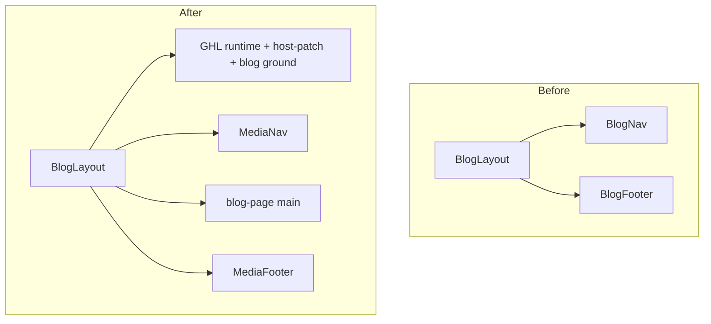

# CAE Blog Full Redesign (chrome + index + slug)

**Status:** Implemented (W1–W4)  
**Date:** 2026-07-23

## Audit: why the blog has its own header/footer

The split was **intentional in the first public-blog pass**, not an accident:

| Surface | Chrome | Why |
|---------|--------|-----|
| Home | GHL `Nav` + `Footer` + full GHL CSS (`HomeLayout`) | Marketing lift |
| Media | GHL `MediaNav` + `MediaFooter` + GHL CSS (`MediaLayout`) | Same visual family as home |
| Blog | Custom `BlogNav` / `BlogFooter` + `blog-chrome.css` inside `BlogLayout` | Prior plan kept blog **off** the GHL stack so articles stayed a light “editorial column” |

That choice created a **site break**: Blog feels like a different product (minimal text nav, narrow shell, scaffold typography). For a brand site, **chrome must match home**.

### Why the slug UI feels weak (current)

- Utilitarian stack: title → meta → small hero → byline → takeaway box → body — no cinematic hierarchy.
- Content locked in a ~56rem shell; hero never reads as a real visual plane.
- Index is a thin lead + list-rows, not a magazine/discovery surface.
- Section polish (TOC/FAQ) is functional but still “admin output on a dark page.”
- Custom chrome reinforces “temporary scaffold,” not CAE marketing quality.

---

## Locked decisions

1. **Header + footer = homepage family** — reuse GHL nav + footer. Remove `BlogNav` / `BlogFooter` from the public reading path.
2. **Article body stays native** (not a GHL HTML lift) — modern CSS for index/slug content only; GHL CSS only for site chrome + page ground.
3. **Modern editorial redesign** of both `/blog` and `/blog/[slug]` — not another polish pass on the scaffold.
4. **Keep** Supabase data model, Admin, JSON-LD helpers, markdown → HTML pipeline.

**Chrome implementation (committed):** Mirror the **Media page pattern** (already base-aware, already has BLOG in nav):

```text
BlogLayout (document + GHL CSS + SeoHead)
  └ preview-container
       ├ MediaNav
       ├ <main class="blog-page"> … redesigned content … </main>
       └ MediaFooter
```

Prefer **MediaNav + MediaFooter** so Success Stories links to `{BASE}/#section-…` (home hash) when browsing from `/cae/blog`. Home `Nav` alone uses bare `#section-…`, which breaks off-home.

---

## Design direction: “CAE editorial magazine”

Stay on CAE dark purple / Hanken + Archivo (brand). Aim for **modern long-form** (clear magazine hero + comfortable reading), not a second marketing collage and not a cream “newspaper” look.

### Index `/cae/blog`

```text
[ GHL Nav — same as media/home family ]
────────────────────────────────────────
 full-width page intro band
   Insights
   short lede
────────────────────────────────────────
 FEATURED (newest)
   near-bleed hero image
   category · date · read time
   large title
   excerpt
   Read article →
────────────────────────────────────────
 All articles (if >1)
   responsive grid: image-led tiles
   (not hairline list rows)
────────────────────────────────────────
[ GHL Footer ]
```

### Post `/cae/blog/[slug]`

```text
[ GHL Nav ]
────────────────────────────────────────
 full-bleed hero (dominant visual plane)
 title + meta on/under hero with scrim for legibility
 category · date · read time
────────────────────────────────────────
 reading column (~40–42rem) centered
   compact author byline
   refined key takeaway
   sticky TOC (desktop) / collapse (mobile) — offset under GHL nav
   body: larger type, generous H2 rhythm, better lists/quotes
   FAQ accordion with clear section break
   sources
   related as image cards
────────────────────────────────────────
[ GHL Footer ]
```

**Motion (2–3 intentional):** hero fade/rise on load; TOC active-section highlight; soft hover on index tiles.

---

## Architecture



### Files (high level)

| Area | Action |
|------|--------|
| `apps/cae/src/components/blog/BlogLayout.astro` | GHL CSS shell; MediaNav + MediaFooter; drop BlogNav/BlogFooter; keep SeoHead/jsonLd/og |
| `blog-chrome.css` / BlogNav / BlogFooter | Remove from public path after cutover |
| New/rewrite `blog-page.css` / `blog.css` | Full visual system for index + article under `.blog-page` |
| `pages/blog/index.astro` + LeadPost + PostCard | Magazine featured + grid |
| `pages/blog/[slug].astro` + section components | Hero-led article; typography; related cards |
| Host patch if needed | GHL nav sticky vs blog TOC `top` offset |

### CSS strategy

- Import GHL runtime + host-patch (+ thin ground matching home `#100022`).
- Scope article styles under `.blog-page`.
- Do **not** load homepage section CSS (offerings/pillars/etc.).

---

## Implementation waves

### W1 — Site chrome alignment
- Wire BlogLayout → MediaNav + MediaFooter + GHL CSS shell.
- Verify Blog / Media / Home / Success Stories under `/cae`.
- Remove BlogNav/BlogFooter from layout.
- **Done when:** Blog first 100px + footer match home/media family.

### W2 — Index redesign
- Featured lead (near-bleed image, strong title, CTA).
- Remaining posts as image-led grid.
- **Done when:** `/cae/blog` reads as a modern magazine index.

### W3 — Slug redesign
- Full-bleed hero + title/meta treatment.
- Typography overhaul; takeaway/FAQ/related restyle; related cards.
- TOC sticky under GHL header height.
- **Done when:** Zi Wei post feels intentional at 375px and 1280px.

### W4 — QA
- Typecheck/build; cross-route nav; JSON-LD; 404; no GHL bleed into prose.

---

## Checklist

- [x] W1 — GHL chrome on blog
- [x] W2 — Index magazine redesign
- [x] W3 — Slug redesign
- [x] W4 — QA (typecheck + build green)

## Out of scope

Admin UI, Featured DB flag, category/tag routes, pagination, rewriting post markdown, full homepage section collage on blog.

## Success criteria

- Header/footer on blog visually match home/media (same GHL components).
- Index and slug feel modern and brand-grade.
- Body measure stays ~40–42rem.
- Zi Wei post is the visual QA fixture.
