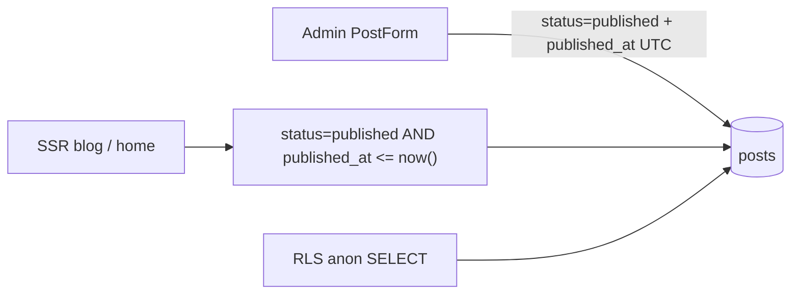

# Implementation plan: CAE blog scheduled publishing

**Status:** All implementation tasks complete (2026-07-27) — end-to-end acceptance pending manual verify
**Date:** 2026-07-27
**Feature:** Treat Admin "Publish at" as go-live time (lazy time-gate; no cron)

---

## Locked product model

| Stored `status` | `published_at` | Public blog | Admin label |
|-----------------|----------------|-------------|-------------|
| `draft` | any | Hidden | Draft |
| `published` | `null` | Server stamps `now()` silently (Decision 1: stamp, not reject) | - |
| `published` | `> now()` | Hidden until due | **Scheduled** |
| `published` | `<= now()` | Visible | Published |
| `archived` | any | Hidden | Archived |

- **`status = published`** means approved to go live at `published_at`, not "visible immediately."
- Unpublish = `draft`. Archive = `archived`.
- No fourth DB status, no cron/worker, no Vercel/Supabase job.
- Picker uses browser local time; store UTC in `published_at`.

### Locked design decisions

| # | Decision | Choice |
|---|----------|--------|
| 1 | `published` saved with no `publishedAt` | **Stamp to `now()`** silently in the server helper; never reject |
| 2 | Admin "Published" filter tab | **Live-only** -- `published_at <= now()`; scheduled posts only appear under the Scheduled tab |
| 3 | Dashboard count cards | **Add a dedicated "Scheduled" card** alongside Draft / Published / Archived / Total |
| 4 | `PostStatusCounts` type | **Add `scheduled: number` field** and split `countPostsByStatus` with `isPostScheduled` |
| 5 | RLS policy target role | **`anon` only** -- authenticated editors already bypass via the `"Editors manage posts"` FOR ALL policy |



---

## How to run with multitask agents

### Frozen shared contract (all agents must match this)

Add and export from `@seo/blog` (Task A owns the implementation; other tasks only import):

```ts
/** True when the Post is visible on the public blog right now. */
export function isPostLive(
  post: { status: PostStatus; publishedAt: string | null },
  now?: Date,
): boolean;

/** True when approved (`published`) but not yet past publishedAt. */
export function isPostScheduled(
  post: { status: PostStatus; publishedAt: string | null },
  now?: Date,
): boolean;
```

Semantics:

- `isPostLive` => `status === "published" && publishedAt !== null && Date.parse(publishedAt) <= now.getTime()`
- `isPostScheduled` => `status === "published" && publishedAt !== null && Date.parse(publishedAt) > now.getTime()`

Public Supabase filter (Task A):

```ts
.eq("status", "published")
.not("published_at", "is", null)
.lte("published_at", new Date().toISOString())
```

RLS `USING` clause (Task B) must match the same three conditions.

### File ownership (do not edit another task's files)

| Task | Exclusive files |
|------|-----------------|
| **A** | `packages/blog/src/**`, `packages/blog/package.json` only if needed |
| **B** | `supabase/migrations/**` only (one new migration file) |
| **C** | `apps/cae/src/components/admin/PostForm.tsx`, `PostForm.module.css` if styles needed |
| **D** | `apps/cae/src/components/admin/admin-post-list.ts`, `apps/cae/src/pages/admin/posts/index.astro`, `apps/cae/src/pages/admin/index.astro`, admin list CSS if present |
| **E** | `apps/cae/src/components/blog/resolve-related.ts` only |
| **F** | `apps/cae/CONTEXT.md`, `docs/future-enhancements/scheduled-publishing.md`, optional wiki under `seo-wiki-vault/wiki/**` |

### Parallel waves

```text
Wave 1 (start together - zero file overlap):
  Agent A -- packages/blog helpers + public queries + admin null guard
  Agent B -- Supabase RLS migration
  Agent F -- language / docs

Wave 2 (start ONLY after Task A is merged):
  Agent C -- Admin PostForm
  Agent D -- Admin posts list
  Agent E -- resolve-related live filter

WARNING: Wave 2 agents import isPostLive / isPostScheduled from @seo/blog.
These symbols do not exist until Task A merges. Running Wave 2 before Task A
merges will produce TypeScript compile errors.
```

**Recommended multitask launch:** run **A + B + F** first in parallel; when A is merged (confirmed in the integration branch), run **C + D + E** in parallel.

**Integration order:** A -> B -> C/D/E (any order among C-E) -> F can merge anytime after model is locked (already is).

### Out of scope (all agents)

- Fourth DB status `scheduled` / eager cron promotion
- Vercel Cron, Supabase `pg_cron`, Edge Functions
- Recurring schedules, per-author timezones, CMS-wide scheduling
- Changing public date display format (still "posted on"; it also gates go-live)

---

## Task A -- `@seo/blog` live helpers + public time-gate

**Status:** Done (2026-07-27) — `visibility.ts`, `posts-public.ts`, `posts-admin.ts`, `index.ts`

**Goal:** Single source of truth for "is this Post live?" and apply it to every public query.

**Owns:** `packages/blog/src/**`

### Checklist

- [x] Add `isPostLive` and `isPostScheduled` (new file e.g. `visibility.ts`; prefer a small dedicated module).
- [x] Re-export both from `packages/blog/src/index.ts`.
- [x] Update `listPublishedPosts`, `listPublishedPostsPage`, and `getPublishedPostBySlug` in `posts-public.ts` with the frozen filter (`status` + non-null `published_at` + `lte now`).
- [x] **IMPORTANT: `listPublishedPostsPage` runs TWO separate Supabase queries internally -- a count query (`select("id", { count: "exact", head: true })`) and a data page query. Both must receive the full three-clause time-gate. If only the data query is updated, the `total` count will include future-dated posts, breaking pagination math and the page-overflow re-fetch logic.**
- [x] Grep `packages/blog/src` for any other `.eq("status", "published")` in public helpers and apply the same gate.
- [x] In `posts-admin.ts` `createPost` and `updatePost`: if the input explicitly sets `status` to `"published"` and `publishedAt` is null or undefined, **silently stamp `new Date().toISOString()`** before writing to the DB (Decision 1 -- do not throw). This keeps the server tolerant and consistent with what the form's auto-fill already does. **Note:** both `status` and `publishedAt` are optional in `UpdatePostInput`; the null-stamp guard can only fire when `status` is explicitly `"published"` in the same call. Add a JSDoc comment noting that a bare `{ publishedAt: null }` update without an explicit `status: "published"` will not trigger the stamp.
- [x] Keep `PostStatus` union unchanged: `"draft" | "published" | "archived"`.
- [x] JSDoc on helpers stating Admin "Scheduled" is computed, not a DB status.

### Definition of completion

- [x] `isPostLive` and `isPostScheduled` are exported from `@seo/blog` and match the frozen contract exactly.
- [x] All public list/get helpers exclude future-dated and null-`published_at` rows -- including **both** the count query and the data query inside `listPublishedPostsPage`.
- [x] Creating or updating a Post as `published` without `publishedAt` cannot persist `published_at = null`.
- [x] Package typechecks clean; no changes outside `packages/blog/src/**`.

---

## Task B -- Supabase RLS time-gate

**Status:** Done (2026-07-27) — `supabase/migrations/20260727033138_posts_public_read_published_at_gate.sql`

**Goal:** Anon clients cannot read future-dated Posts even if they bypass the app helpers.

**Owns:** one new file under `supabase/migrations/`

### Checklist

- [x] Create migration e.g. `YYYYMMDDHHMMSS_posts_public_read_published_at_gate.sql`.
- [x] Drop the existing `"Public read published posts"` policy on `public.posts` and create a new SELECT policy targeting **`anon` only** (Decision 5) with `USING`:
  ```sql
  status = 'published'
    AND published_at IS NOT NULL
    AND published_at <= now()
  ```
- [x] **Do not add `authenticated` to this policy.** The existing `"Editors manage posts"` policy is `FOR ALL` to `authenticated` with `USING (true)`, which already covers authenticated SELECT for all posts (including scheduled and draft). RLS policies for the same role + operation are OR'd, so adding `authenticated` here would have no effect and would obscure intent.
- [x] Do not drop the `"Editors manage posts"` policy -- Admin reads depend on it.
- [x] Add an index `(site_id, status, published_at DESC NULLS LAST)` on `public.posts` to support the new three-clause queries efficiently. The existing `(site_id, status)` index does not include `published_at`.
- [x] Do **not** change write policies, the `status` CHECK constraint, or add a `scheduled` DB status.
- [x] Comment in the migration that this matches `@seo/blog` public query semantics.

### Definition of completion

- [x] Migration is additive, named, and only touches the public-read SELECT policy and adds the index.
- [x] After apply: a row with `status = 'published'` and `published_at` in the future is **not** selectable as anon.
- [x] After apply: a row with `status = 'published'` and `published_at` in the past **is** selectable as anon.
- [x] Admin authenticated reads (via `"Editors manage posts"` FOR ALL policy) still return all posts regardless of `published_at`. Do not break that.

---

## Task C -- Admin PostForm "Publish at" UX

**Status:** Done (2026-07-27) — `apps/cae/src/components/admin/PostForm.tsx`

**Goal:** Date/time field is the go-live schedule; copy and validation match the locked model.

**Owns:** `apps/cae/src/components/admin/PostForm.tsx` (+ CSS module only if needed)

**Depends on:** Task A merged (import `isPostScheduled` / `isPostLive` if useful for messaging).

### Checklist

- [x] Rename label from "Published at" to **"Publish at"**.
- [x] Replace hint "not a schedule" with: the date and time this Post appears on the public blog (browser local time, stored as UTC).
- [x] Keep the existing auto-stamp-to-now behaviour when switching status to `published` with an empty datetime field.
- [x] Client validation: block save if `status === "published"` and `publishedAtLocal` is empty (the auto-stamp means this path is rarely hit, but add the guard).
- [x] Success message after save:
  - future `publishedAt` -> e.g. "Scheduled for {local datetime}."
  - past/now -> e.g. "Published."
  - draft / archived -> keep existing tone.
- [x] Status `<select>` stays `draft | published | archived` only (no fourth option).
- [x] Do not edit admin list files or `packages/blog` files.

### Definition of completion

- [x] Saving `published` + future datetime succeeds and the success message says scheduled.
- [x] Saving `published` + empty datetime is auto-filled to now, never silently null.
- [x] UI copy no longer describes the field as "display only / not a schedule."
- [x] Form typechecks clean; only Task C files changed.

---

## Task D -- Admin posts list: Scheduled filter, counts, badges

**Status:** Done (2026-07-27) — `admin-post-list.ts`, `admin/posts/index.astro`, `admin/index.astro`

**Goal:** Editors can find and recognise scheduled Posts without a DB status change.

**Owns:** `apps/cae/src/components/admin/admin-post-list.ts`, `apps/cae/src/pages/admin/posts/index.astro`, `apps/cae/src/pages/admin/index.astro`, admin list CSS if required

**Depends on:** Task A merged (`isPostScheduled` / `isPostLive` available from `@seo/blog`).

### Checklist

**Type and parsing fixes (required to avoid TypeScript errors):**

- [x] Extend `PostStatusFilter` to `"all" | PostStatus | "scheduled"`.
- [x] In `parseStatusFilter`: add an explicit branch `if (normalized === "scheduled") return "scheduled"` **before** the `isPostStatus` call. Without this, `?status=scheduled` falls through to `"all"` because `isPostStatus("scheduled")` is `false`.
- [x] In `listPostsOptionsForFilter`: handle `"scheduled"` explicitly by returning `{ status: "published" }` (fetch all stored-published rows; narrow to scheduled in memory). The function return type `{ status?: PostStatus }` cannot hold `"scheduled"`, so the special case is required to avoid a type error.

**Counts and types (Decision 3 + 4):**

- [x] Extend `PostStatusCounts` to add `scheduled: number` field (Decision 4). `published` in the counts means live-only; `scheduled` means future-dated. Do not double-count.
- [x] Update `countPostsByStatus` to use `isPostLive` for `published` and `isPostScheduled` for `scheduled`.
- [x] Update `admin/index.astro` (dashboard) to show a dedicated **"Scheduled" count card** (Decision 3). The card links to `?status=scheduled`. Place it between Published and Archived in the grid. The existing Published card now shows only live posts (`counts.published`) and links to `?status=published` (live-only, Decision 2). Without this, a scheduled post inflates the Published count on the dashboard but disappears from the Published filter tab -- a misleading mismatch.

**Badges and CSS:**

- [x] Add a `formatPostDisplayLabel(post: BlogPost, now?: Date): string` function (or equivalent) that returns `"Scheduled"` when `isPostScheduled(post)` and falls back to `formatPostStatusLabel(post.status)` otherwise. Do **not** change the signature of the existing `formatPostStatusLabel`.
- [x] In `posts/index.astro`, replace the raw `{formatPostStatusLabel(post.status)}` call in both the table and card views with the new display-label function.
- [x] The existing `statusModifier(post.status)` call produces `admin-posts__status--published` for scheduled posts. Add a parallel computed modifier (e.g. `admin-posts__status--scheduled`) and use it based on `isPostScheduled`.
- [x] Add CSS for `.admin-posts__status--scheduled` pill in the Astro file's `<style>` block.

**Filter tab (Decision 2):**

- [x] Add a "Scheduled" filter tab to the `filterTabs` array in `posts/index.astro`. Position it between Published and Archived.
- [x] The `published` tab shows **live-only** posts (Decision 2): fetch `status: "published"` from the DB then filter with `isPostLive`. A future-dated post must not appear here.
- [x] The `scheduled` tab shows future-dated posts only: fetch `status: "published"` from the DB then filter with `isPostScheduled`.
- [x] `all` tab remains unchanged -- shows every row regardless of timing or status.
- [x] Empty state for the Scheduled tab: "No scheduled posts. Set a future 'Publish at' date when publishing a post."

### Definition of completion

- [x] `?status=scheduled` shows only future-dated `published` posts.
- [x] `?status=published` shows only live posts (past or current `published_at`).
- [x] Dashboard count cards distinguish Scheduled vs Published.
- [x] Row badges show "Scheduled" vs "Published" correctly for posts sharing the same stored status.
- [x] Typechecks clean; only Task D files changed.

---

## Task E -- Related posts live filter

**Status:** Done (2026-07-27) — `apps/cae/src/components/blog/resolve-related.ts`

**Goal:** Related modules never surface a not-yet-live Post.

**Owns:** `apps/cae/src/components/blog/resolve-related.ts`

**Depends on:** Task A merged (`isPostLive` available from `@seo/blog`).

**Note:** After Task A's changes, `listPublishedPosts` (the function that feeds the related list in `[slug].astro`) already returns only time-gated rows. The `post.status === "published"` check inside `resolveRelatedPublishedPosts` would therefore always pass for every row in the input. Replacing it with `isPostLive` is correct defensive practice -- it ensures this module is safe regardless of whether the caller remembered to pre-filter -- but it is not the primary scheduling gate.

### Checklist

- [x] Import `isPostLive` from `@seo/blog`.
- [x] Replace the `post.status === "published"` check inside the `byId` loop with `isPostLive(post)`.
- [x] Update the fileoverview JSDoc to say: "omits drafts, archived, not-yet-live (scheduled), and missing ids."
- [x] Do not change callers (`[slug].astro`) unless a type break forces it.

### Definition of completion

- [x] A related id pointing at a future-dated `published` post is omitted from the resolved list even when present in the input array.
- [x] Live related posts still resolve in id order.
- [x] Only Task E file changed; typechecks clean.

---

## Task F -- Language and docs

**Status:** Done (2026-07-27) — CONTEXT, deferred doc, wiki sites/cae + packages/blog + log

**Goal:** Product language matches the new semantics; deferred doc marked done.

**Owns:** `apps/cae/CONTEXT.md`, `docs/future-enhancements/scheduled-publishing.md`, optional wiki under `seo-wiki-vault/wiki/**`

### Checklist

- [x] Update `apps/cae/CONTEXT.md`:
  - **Post / Published:** approved; visible when `published_at <= now()`.
  - Add **Scheduled:** Admin label for `published` + future `published_at` (not a DB status).
  - Remove or rewrite the "avoid scheduled publish" and "visible immediately" language where it is now obsolete.
- [x] Update `docs/future-enhancements/scheduled-publishing.md`:
  - Status -> **Implemented** (lazy time-gate + computed Admin Scheduled label).
  - Link to `docs/implementation-plan/cae-blog-scheduling.md`.
  - Note: no worker/cron.
  - Check off the acceptance bullets that this model satisfies.
- [x] Optional: short wiki note on `seo-wiki-vault/wiki/sites/cae.md` and/or `wiki/packages/blog.md` if those pages describe publish semantics.

### Definition of completion

- [x] `CONTEXT.md` no longer describes `published_at` as display-only or Published as always immediately visible.
- [x] The deferred enhancement doc reflects the implemented model and links here.
- [x] No code changes in this task.

---

## End-to-end acceptance (after all tasks merge)

- [ ] Future `published_at` + `status = published` -> absent from `/cae/blog`, home Insights, related posts, and anon RLS until that instant.
- [ ] After that time -> appears with no manual status click.
- [ ] Past/now `published_at` -> live immediately.
- [ ] Unpublish (`draft`) and Archive still hide the post.
- [ ] Admin list and dashboard distinguish Scheduled vs Published counts and badges.
- [ ] Existing live posts with past `published_at` remain visible without any data migration.
- [ ] Slug lock still applies once published/scheduled (`publishedAt` set or status published/archived) -- no change required in `post-slug.ts`.

---

## Agent prompt snippets (copy-paste)

### Wave 1 -- Agent A

```text
Implement Task A only from docs/implementation-plan/cae-blog-scheduling.md.
Own packages/blog/src only. Add isPostLive + isPostScheduled, gate all public queries,
stamp publishedAt on admin create/update when status=published and date missing.

LOCKED DECISION 1: When status=published and publishedAt is null/undefined, silently
stamp now() -- do NOT throw or reject. The form already auto-fills; the server stamp
is a safety net for any future programmatic caller.

CRITICAL: listPublishedPostsPage runs two separate Supabase queries (a count query
and a data page query). Apply the full three-clause time-gate to BOTH or pagination
totals will be wrong.

Do not touch apps/cae or supabase.
```

### Wave 1 -- Agent B

```text
Implement Task B only from docs/implementation-plan/cae-blog-scheduling.md.
Add one Supabase migration that:
1. Drops "Public read published posts" and replaces it with a new SELECT policy
   targeting anon ONLY (Decision 5 -- do NOT include authenticated) with USING:
     status = 'published' AND published_at IS NOT NULL AND published_at <= now()
2. Adds index (site_id, status, published_at DESC NULLS LAST) on public.posts.

The "Editors manage posts" FOR ALL authenticated policy must remain untouched --
that is what allows Admin to read scheduled/draft posts. Do not drop it.
Do not change CHECK constraints or add a scheduled status.
```

### Wave 1 -- Agent F

```text
Implement Task F only from docs/implementation-plan/cae-blog-scheduling.md.
Update apps/cae/CONTEXT.md and docs/future-enhancements/scheduled-publishing.md
to the locked lazy time-gate model. No code changes.
```

### Wave 2 -- Agent C

```text
Implement Task C only from docs/implementation-plan/cae-blog-scheduling.md.
Task A must already be merged before starting (isPostLive / isPostScheduled must exist in @seo/blog).
Update PostForm: rename field label to "Publish at", replace "not a schedule" hint,
keep auto-stamp-to-now, add scheduled vs published success message.
Do not edit admin list files or packages/blog.
```

### Wave 2 -- Agent D

```text
Implement Task D only from docs/implementation-plan/cae-blog-scheduling.md.
Task A must already be merged before starting.

LOCKED DECISIONS (do not deviate):
- Decision 2: "Published" tab = live-only (published_at <= now). Scheduled posts go to Scheduled tab only.
- Decision 3: Add a dedicated "Scheduled" count card on the dashboard (admin/index.astro).
- Decision 4: Add scheduled: number to PostStatusCounts; split countPostsByStatus with isPostLive / isPostScheduled.

CRITICAL type fixes required:
1. parseStatusFilter must explicitly handle "scheduled" BEFORE calling isPostStatus,
   or ?status=scheduled silently falls through to "all".
2. listPostsOptionsForFilter must return { status: "published" } when filter is "scheduled"
   and narrow in memory -- it cannot return { status: "scheduled" } because "scheduled"
   is not a PostStatus.
3. formatPostStatusLabel only accepts PostStatus -- add a new formatPostDisplayLabel
   function that checks isPostScheduled first.

Own: admin-post-list.ts, admin/posts/index.astro, admin/index.astro, list CSS.
```

### Wave 2 -- Agent E

```text
Implement Task E only from docs/implementation-plan/cae-blog-scheduling.md.
Task A must already be merged before starting.
In resolve-related.ts replace post.status === "published" with isPostLive(post).
This is defensive -- the upstream listPublishedPosts already time-gates after Task A,
but this module should be safe regardless of caller.
No other files.
```
