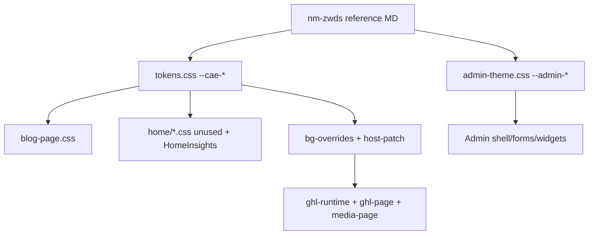
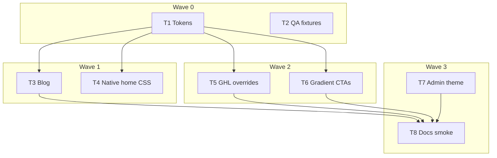

# Plan: CAE website ← nm-zwds design theme & color scheme

**Status:** Implemented (T1–T8 code/docs) — GHL residuals documented; human visual QA (375/1280) still open  
**Date:** 2026-07-28  
**Reference:** [`docs/references/nm-zwds-design-theme-color-scheme.md`](../references/nm-zwds-design-theme-color-scheme.md)  
**Domain language:** [`apps/cae/CONTEXT.md`](../../apps/cae/CONTEXT.md)  
**Scope app:** `apps/cae` only (do not change `apps/dr-jasmine`, gateway routing, or shared `@seo/blog` APIs)

### Progress log

- **2026-07-28:** T1 tokens + gradient utilities landed (`tokens.css`, `brand-gradient.css`, `global.css` import; Decision B shell; typecheck + build green)
- **2026-07-28:** T2 Appendix B QA checklist landed (single Brand theme QA source of truth)
- **2026-07-28:** Launched T3, T4, T5+T6, T7 in parallel
- **2026-07-28:** T3 blog surfaces retuned (`blog-page.css` → nm-zwds tokens, gold hover/focus, gradient eyebrow; typecheck + build green)
- **2026-07-28:** T4 native home CSS + HomeInsights on `--cae-*`; cream/navy light bands; build green
- **2026-07-28:** T5+T6 GHL home/media patch + brand gradient CTAs/footer (`host-patch.css`, `ghl-runtime.css` token import, carousel gold; residuals in Appendix B)
- **2026-07-28:** T5+T6 resumed after abort — verified selectors against fragments/capture; polished gradient-text `@supports` fallback + media `--color-mcx1lu3u` remap; build check
- **2026-07-28:** T7 Admin theme aligned (cream/navy/purple light; night/gold dark)
- **2026-07-28:** T8 closeout — Brand theme note in `CONTEXT.md` / `README.md` (+ wiki one-liner); `pnpm --filter @seo/cae typecheck` + `build` green; plan status Implemented (code/docs); human 375/1280 visual QA left open in Appendix B

---

## Goal

Bring CAE’s public site and Admin closer to the **nm-zwds** (“Purple Star Astrology”) product palette so the website and the client-facing app feel like one personal brand: warm parchment cream, deep indigo night sky, soft purple, gold/coral accents, and the **5-stop brand gradient**.

This is a **token-first rebrand + surface rollout**, not a full IA rewrite and not a rebuild of GHL HTML sections from scratch.

---

## Current state (audit)

| Surface | How it’s styled today | Theme coupling |
|---------|----------------------|----------------|
| Home `/cae/` | GHL lift (`HomeLayout` + `ghl/*` + `ghl-page.css` / `ghl-runtime.css`) | **Hardcoded GHL hex** (`#100022`, `#140625`, `#9461A3`, `#F9F1FF`, …) |
| Media `/cae/media` | Same GHL family (`MediaLayout` + `media-page.css`) | Hardcoded GHL hex |
| Blog index + slug | Native `.blog-page` under GHL chrome | Mostly **`--cae-*` tokens** (`tokens.css`) |
| Native `home/*.css` + `components/home/*` | Present but **mostly unwired** (HomeInsights is the live exception) | Token-aware; good future path |
| Admin `/cae/admin` | `admin-theme.css` + shell/forms | Separate `--admin-*` light/dark (purple-adjacent, **not** nm-zwds cream/gold) |

### Gap vs nm-zwds (high level)

| Aspect | nm-zwds | CAE website today |
|--------|---------|-------------------|
| Mood | Cream parchment + purple night; gold interactive in dark | Dark purple marketing only; little cream/gold language |
| Brand signature | 5-stop gradient `#080657 → #3D0F68 → #8B1167 → #D91744 → #FE8E01` | **Absent** |
| Primary interactive (light) | Brand purple `#6B5B95` | Admin/links use `#4c247a` / `#7a4d9a` family |
| Primary interactive (dark) | Gold `#D4AF7B` / `#D4B896` | Lavender CTAs / white outline buttons; star `#f4b400` only |
| Page shell (dark) | `#2D1B4E` / `#1A0F2E` | `#100022` / `#140625` / `#0a0114` |
| Light shell | Cream `#F6F0E8`, white cards | Rare light strips (`#F9F1FF` press), Admin lavender-tinted light |
| UI font | Inter | Hanken Grotesk |
| Display / titles | Serif for analysis titles; bold uppercase heroes | Archivo Black uppercase heroes |
| Semantic tokens | `theme-*` + light/dark class | `--cae-*` (public) + `--admin-*` (Admin); no shared brand-gradient tokens |

---

## Locked decisions

| # | Decision | Choice |
|---|----------|--------|
| 1 | Source of truth for hex | nm-zwds reference doc (mirror app `color-scheme.css` roles). Document any intentional CAE deltas in `tokens.css` comments. |
| 2 | Public marketing mode | Stay **dark-first** (night sky). Map public surfaces to nm-zwds **dark** roles, not a cream homepage flip. |
| 3 | Cream usage on public site | Cream / warm surfaces for **light bands only** (press, pillars bar, white testimonial cards, optional blog callouts) — not full-page light marketing. |
| 4 | Brand gradient | Add as first-class CSS tokens + utilities. Use on **footer accents, primary filled CTAs, logo/wordmark clip-text (≤1–2 per viewport)**. Do not paint over photographic heroes. |
| 5 | Typography (v1) | **Keep Hanken Grotesk + Archivo Black** on public marketing/blog (GHL + existing magazine system). Do **not** force Inter site-wide in v1 (would fight GHL font stacks and Archivo hero voice). Optional: Inter on Admin only in a later task if desired. |
| 6 | GHL strategy | **Override / patch**, do not re-capture or rewrite all GHL HTML. Prefer `tokens.css` → `bg-overrides.css` / `host-patch.css` / thin remaps. Native `home/*` stays dormant unless a later wave rewires HomePage. |
| 7 | Admin | Align `--admin-*` to nm-zwds light/dark semantics (cream shell, brand purple / gold interactive, coral danger). Keep Admin theme toggle behavior. |
| 8 | Out of scope | Dr Jasmine app; nm-zwds app code changes; Tailwind theme port; star-field canvas from the app; changing Post/Author/Category domain model. |

### Open decision (resolve before T5 if contested)

| Topic | Options | Default if no reply |
|-------|---------|---------------------|
| How hard to shift dark shell hex | **A)** Soft align (keep near-black `#100022` family, retune accents + gradient) · **B)** Hard align (shell → `#2D1B4E` / `#1A0F2E`) | **B** for tokens + blog/Admin; **A→B hybrid** for GHL (override section BGs where safe, accept residual GHL hex until native home) |

---

## Target token map (public `--cae-*`)

Map existing CAE custom properties onto nm-zwds roles. Exact names may stay `--cae-*` for less churn; values change.

| CAE token (today) | New role / target | nm-zwds hex |
|-------------------|-------------------|-------------|
| `--cae-bg` | Page shell (dark) | `#2D1B4E` (surface-dark) |
| `--cae-bg-deep` | Deeper shell / footer | `#1A0F2E` (surface-darkSecondary) |
| `--cae-bg-elevated` / `--cae-bg-header` | Elevated / nav | `#3D2860` (surface-darkElevated) or keep slightly darker header if contrast needs it |
| `--cae-surface` / soft / panel | Cards / soft fills | `#3D2860` / `#1A0F2E` + purple opacity panels |
| `--cae-text` / bright / soft | Primary cream text | `#F6F0E8` (+ near-white variants sparingly) |
| `--cae-text-muted*` | Secondary | `#C4C4C4` / `#B8AED0` subtle |
| `--cae-purple` / accent / lavender* | Brand purple scale | `#6B5B95` / `#4A3F6B` / `#9B8FB5` |
| `--cae-star` | Gold accent (was chartreuse-gold) | `#D4B896` or `#D4AF7B` |
| `--cae-press-bg` | Light band | `#F6F0E8` (cream) |
| `--cae-press-text` | Text on cream | `#1A1E3F` (navy) |
| New: `--cae-brand-gradient` | 5-stop gradient | stops in reference |
| New: `--cae-coral` | Danger / error | `#C84C5C` / dark `#D97C6E` |
| New: `--cae-gold` / `--cae-gold-dark` | Interactive dark CTAs | `#D4B896` / `#D4AF7B` |
| New: `--cae-cream` / `--cae-navy` | Light-panel text/bg | `#F6F0E8` / `#1A1E3F` |

Admin `--admin-*` should parallel the same semantics (light = cream/white/navy/purple; dark = purple night + gold interactive).

---

## Architecture



**Principle:** Change hex at the token layer first; consumers that already use `var(--cae-*)` inherit. GHL and one-off hex get patched in dedicated waves.

---

## Master progress board

Mark a task `[x]` only when its **Definition of done** is fully met.

**Visual QA (T3–T7 / T8):** use [Appendix B — Brand theme QA checklist](#appendix-b--brand-theme-qa-checklist) — single pass/fail matrix.

| Wave | Task | Name | Effort | Status |
|------|------|------|--------|--------|
| 0 | **T1** | Brand token foundation + gradient utilities | M | [x] Done — tokens + `brand-gradient.css`; build green |
| 0 | **T2** | Visual QA fixtures + before/after checklist | S | [x] Done — Appendix B is single QA checklist |
| 1 | **T3** | Blog surfaces consume new tokens | M | [x] Done — `blog-page.css` tokens + gold accents + gradient eyebrow; typecheck/build green |
| 1 | **T4** | Native home CSS + HomeInsights alignment | S | [x] Done — home/*.css + HomeInsights on `--cae-*`; cream/navy light bands; build green |
| 2 | **T5** | GHL home/media overrides (patch path) | L | [x] Done — `host-patch` remap + cream bands; residuals in Appendix B |
| 2 | **T6** | Brand gradient on CTAs / footer / selective text | M | [x] Done — Connect CTAs + footer/logo hairlines + Connect clip-text |
| 3 | **T7** | Admin theme alignment (light cream + dark gold) | M | [x] Done — cream/navy/purple light; night/gold dark |
| 3 | **T8** | Docs / CONTEXT note + smoke + plan closeout | S | [x] Done — CONTEXT/README Brand theme note; typecheck+build green 2026-07-28; human visual QA open |

### Multitask launch order

```text
Wave 0 — start together:
  T1 + T2

Wave 1 — after T1 merged:
  T3 + T4

Wave 2 — after T1 (T3 helpful but not strictly blocking for GHL):
  T5 + T6     ← same owner preferred; T6 may land inside T5 if smaller

Wave 3 — after Wave 1–2:
  T7 then T8  ← T8 last
```



---

## Wave 0 — Foundation

### T1 — Brand token foundation + gradient utilities

| | |
|--|--|
| **Owns** | `apps/cae/src/styles/tokens.css`, optionally thin `apps/cae/src/styles/brand-gradient.css` (imported from `global.css` / layouts that need it) |
| **Depends on** | None (reference MD only) |
| **Must not** | Restyle GHL HTML; change Admin pages; rewrite blog layout structure |

#### Checklist

- [x] Rewrite `:root` `--cae-*` values to match the **Target token map** (dark-first public).
- [x] Add `--cae-brand-gradient` (and stop vars if useful) documenting the 5 hex stops.
- [x] Add `--cae-cream`, `--cae-navy`, `--cae-gold`, `--cae-gold-dark`, `--cae-coral`, `--cae-coral-dark`.
- [x] Add utility classes (plain CSS, not Tailwind): e.g. `.cae-bg-brand-gradient`, `.cae-text-brand-gradient` (background-clip text) with a comment: use ≤1–2 text targets per viewport.
- [x] Comment block at top of `tokens.css` citing `docs/references/nm-zwds-design-theme-color-scheme.md` as source of truth.
- [x] Keep font tokens as Hanken / Archivo for v1 (no Inter swap).
- [x] Ensure `global.css` still imports tokens; no broken `var()` references.

#### Definition of done

- [x] **DoD met (2026-07-28):** `tokens.css` + new `brand-gradient.css` (imported from `global.css`); Decision B shell; typecheck + build green. Gradient utilities ready for T5/T6 consumers.
- Token file alone encodes nm-zwds roles; gradient utilities exist and are unused-or-demo-safe.
- `pnpm`/`npm` typecheck + CAE build still succeed with no consumer changes required (consumers may look wrong until later tasks — that is OK if build is green).
- No secrets or app-source files from nm-zwds copied into the repo (hex only from the reference MD).

---

### T2 — Visual QA fixtures + before/after checklist

| | |
|--|--|
| **Owns** | [Appendix B — Brand theme QA checklist](#appendix-b--brand-theme-qa-checklist) in this plan (single source of truth) |
| **Depends on** | None |
| **Must not** | Change production CSS beyond docs |

#### Checklist

- [x] List QA routes: `/cae/`, `/cae/media`, `/cae/blog`, one real `/cae/blog/[slug]`, `/cae/admin/login`, `/cae/admin` (light + dark).
- [x] List viewport sizes: 375px and 1280px.
- [x] Note brand-test: after removing nav, first viewport still reads as CAE / Purple Star (gradient or night + cream accents present).
- [x] Capture “known GHL residuals” expectations (some GHL hex may remain until native home).

#### Definition of done

- [x] **DoD met (2026-07-28):** Appendix B is the single Brand theme QA checklist for T3–T7 / T8.
- Engineers implementing T3–T7 have a single checklist to mark pass/fail; linked from this plan.

---

## Wave 1 — Token consumers (native)

### T3 — Blog surfaces consume new tokens

| | |
|--|--|
| **Owns** | `apps/cae/src/components/blog/blog-page.css` and any blog component CSS that hardcodes old purple hex; blog layouts only if import needed for gradient utility |
| **Depends on** | T1 |
| **Must not** | Change BlogLayout chrome (MediaNav/Footer); change markdown pipeline; change Admin |

#### Checklist

- [x] Replace remaining raw `#100022` / `#140625` / `#4c247a` / `#b98bc8`-family fallbacks with `var(--cae-*)` where practical.
- [x] Retune accents: links/focus → brand purple / gold per dark semantic roles.
- [x] Light-on-dark reading measure unchanged (~40–42rem body).
- [x] Index featured tile + slug hero still cinematic; no accidental cream full-page blog.
- [x] Optional: one restrained brand-gradient accent (e.g. eyebrow rule or CTA fill) — not on hero photo overlays as stickers.

#### Definition of done

- `/cae/blog` and a published slug at 375px + 1280px look intentional under the new palette.
- No regression: TOC sticky offset, FAQ, related cards, JSON-LD untouched functionally.
- CAE build green.

---

### T4 — Native home CSS + HomeInsights alignment

| | |
|--|--|
| **Owns** | `apps/cae/src/styles/home/*.css`, `apps/cae/src/components/home/home-insights.css` (and related HomeInsights markup only if class hooks needed) |
| **Depends on** | T1 |
| **Must not** | Rewire `HomePage.astro` from GHL → native (that is a future project); edit GHL fragment HTML |

#### Checklist

- [x] Sweep `home/*.css` for hardcoded hex; prefer `var(--cae-*)`.
- [x] Align HomeInsights band to new tokens so the live Blog strip on the GHL home matches brand (this is the one native band on production home).
- [x] Press / pillars light strips use cream `#F6F0E8` + navy text when those native sheets are used later.
- [x] Star/rating accents use gold tokens, not `#f4b400`, in native sheets.

#### Definition of done

- HomeInsights on `/cae/` visually matches the new blog/token language.
- Dormant native home CSS is ready for a future GHL→native cutover without a second rebrand pass.
- Build green.

---

## Wave 2 — GHL public marketing

### T5 — GHL home/media overrides (patch path)

| | |
|--|--|
| **Owns** | `apps/cae/src/styles/ghl/bg-overrides.css`, `host-patch.css`, minimal additions to `ghl-runtime.css` **only if required**; do **not** regenerate full `ghl-page.css` / `media-page.css` unless a surgical search-replace of brand hex is agreed |
| **Depends on** | T1; prefer T4 HomeInsights already aligned |
| **Must not** | Re-run capture scripts as the primary approach; change gateway; break nav hash links |

#### Checklist

- [x] Override preview-container / section background cascade toward `--cae-bg` / `--cae-bg-elevated` where overrides already hook.
- [x] Retune lavender/purple accent overrides to brand purple scale.
- [x] Light bands (press `#F9F1FF` etc.) → cream `#F6F0E8` + navy text via overrides when selectors are stable.
- [x] Media page ground matches home family after overrides.
- [x] Smoke: LogoBar, Nav, Hero, Press, Insights, Pillars, Platform, SocialProof, Carousel, Connect, Footer — no broken layout or invisible text.
- [x] Document any **residual** GHL hex that cannot be overridden without a native rewrite (list in T2 QA notes).

#### Definition of done

- `/cae/` and `/cae/media` read as the same night-sky + cream-accent brand as blog, even if some GHL internals remain.
- Sticky nav, mobile menu, carousel still work.
- Build green; no new console errors on those routes.
- **DoD met (2026-07-28):** `ghl-runtime` imports tokens; `host-patch` remaps GHL `--color-*` + cream bands; residuals in Appendix B.

---

### T6 — Brand gradient on CTAs / footer / selective text

| | |
|--|--|
| **Owns** | CTA/button override CSS (host-patch or small brand CSS), footer accent areas, optional wordmark/heading clip-text; may touch GHL Connect/Footer wrappers sparingly |
| **Depends on** | T1; usually same PR as T5 or immediately after |
| **Must not** | Apply gradient text on top of already colorful hero banners; rainbow every section |

#### Checklist

- [x] Primary filled CTAs (home connect / key buttons) use brand gradient or gold-dark fill per dark-mode interactive rules.
- [x] Footer (or footer top rule / band) uses gradient accent consistent with nm-zwds `bg-footer-light` spirit (adapted for dark site).
- [x] At most 1–2 gradient-text moments above the fold across home.
- [x] Hover/focus states remain accessible (contrast checked on cream and on purple night).

#### Definition of done

- Brand signature gradient is visible within the first screenful of home **or** on primary CTA + footer without looking gimmicky.
- Blog optional gradient accent (if any) matches the same token.
- Build green.
- **DoD met (2026-07-28):** Connect filled CTAs + footer/logo gradient hairlines + Connect clip-text; hero CTA gold-dark on hover.

---

## Wave 3 — Admin + closeout

### T7 — Admin theme alignment

| | |
|--|--|
| **Owns** | `apps/cae/src/styles/admin-theme.css`, `admin-shell.css` light defaults on `:root`, any hardcoded admin page hex that fights the theme |
| **Depends on** | T1 (shared mental model); can parallel Wave 2 |
| **Must not** | Change auth/RLS; redesign Admin IA; force Inter unless explicitly approved in this task |

#### Checklist

- [x] Light theme: page bg → cream `#F6F0E8`; elevated → white; text → navy `#1A1E3F`; interactive → `#6B5B95` → deep `#4A3F6B` on hover; borders purple ~32% opacity feel.
- [x] Dark theme: shell → `#2D1B4E` / cards `#3D2860` / `#1A0F2E`; text cream; interactive → gold dark `#D4AF7B`.
- [x] Danger → coral light/dark; success banners may use `surface-warm` `#F5E8D4` tint where appropriate.
- [x] Primary button text: cream on purple (light); dark secondary `#1A0F2E` on gold (dark) — match nm-zwds roles.
- [x] TipTap / forms / status chips remain readable; focus rings use brand purple / gold.
- [x] Theme toggle still switches `data-theme` correctly.

#### Definition of done

- Login + post list + post editor + author + categories pass light and dark visual check at 1280px.
- Admin no longer feels like a different purple product from nm-zwds light/dark.
- Build green.

---

### T8 — Docs / CONTEXT note + smoke + plan closeout

| | |
|--|--|
| **Owns** | `apps/cae/CONTEXT.md` or `apps/cae/README.md` (brand theme pointer), this plan status, T2 QA checklist completion |
| **Depends on** | T3–T7 as implemented |
| **Must not** | Rewrite unrelated wiki; invent new product language |

#### Checklist

- [x] Short “Brand theme” note: source = nm-zwds reference; public dark-first; tokens in `tokens.css` + `brand-gradient.css`; Admin in `admin-theme.css`; GHL via host-patch/bg-overrides.
- [x] Link this plan + reference MD (`apps/cae/CONTEXT.md`, `README.md`; wiki one-liner pointer).
- [x] Run [Appendix B](#appendix-b--brand-theme-qa-checklist) agent smoke (`typecheck` + `build`); date noted. Human 375/1280 viewport rows left unchecked (not browser-verified).
- [x] Set this plan **Status** to Implemented (T1–T8 code/docs) with GHL residuals + human visual QA still open.
- [x] Master progress board tasks marked `[x]` only where DoD met (T1–T8).

#### Definition of done

- [x] **DoD met (2026-07-28):** Brand theme documented in CONTEXT/README; future agents must not reintroduce `#9461A3` / `#100022` as new sources of truth — use tokens. Plan board + Appendix B closeout reflect reality (build green; visual QA human-owned).

---

## Global Definition of Done (program)

The brand alignment program is **done** when all of the following hold:

1. **Tokens** — `tokens.css` (+ Admin theme) encode nm-zwds roles and the 5-stop gradient.
2. **Blog + Admin** — Clearly same family as the app’s dark/light semantics.
3. **Home + Media** — Recognizably aligned via overrides; residuals documented if any.
4. **Brand gradient** — Visible on agreed CTA/footer (and sparing text), not sprayed everywhere.
5. **Typography** — Public still Hanken + Archivo (v1); no accidental Inter regression in GHL font links unless a follow-up task changes it.
6. **QA** — T2 checklist completed at 375px and 1280px for listed routes. **(2026-07-28: agent typecheck/build green; human viewport matrix still open in Appendix B.)**
7. **Build** — CAE typecheck/build green; no auth/blog regressions.

---

## Out of scope / follow-ups (do not block v1)

| Item | Why later |
|------|-----------|
| Full GHL → native `HomePage` rewire | Large product project; tokens/native CSS prepared by T4 |
| Inter site-wide or serif analysis titles on blog | Conflicts with Archivo magazine voice; revisit after native home |
| Star-field background from nm-zwds | Atmosphere feature, not required for color alignment |
| Porting Tailwind `theme-*` class names | CAE is plain CSS/Astro, not Tailwind |
| Syncing hex automatically from nm-zwds repo | Manual mirror via reference MD is enough for v1 |
| Dr Jasmine brand changes | Separate brand |

---

## Risk register

| Risk | Mitigation |
|------|------------|
| GHL CSS specificity blocks overrides | Prefer existing `bg-overrides` / `host-patch`; escalate to surgical hex replace in capture CSS only with clear diff |
| Hard shell shift (`#2D1B4E`) makes photos/logo clash | Soften header/hero overlays; keep logo assets; visual QA on hero first |
| Cream press band + navy text reduces “wow” | Keep dark hero dominant; cream only for proof/press strips |
| Admin gold CTAs low contrast | Verify WCAG-ish contrast; adjust gold stop or button text token |
| Dual sources of truth (tokens vs GHL file) | T8 docs + forbid new hardcoded brand hex in native CSS |

---

## Appendix A — Brand gradient (copy reference)

| Stop | Hex |
|------|-----|
| 1 | `#080657` |
| 2 | `#3D0F68` |
| 3 | `#8B1167` |
| 4 | `#D91744` |
| 5 | `#FE8E01` |

---

## Appendix B — Brand theme QA checklist

**Single checklist for T3–T7 visual pass/fail and T8 final smoke.**  
Reference palette: [`docs/references/nm-zwds-design-theme-color-scheme.md`](../references/nm-zwds-design-theme-color-scheme.md).

How to use: after each owning task (T3–T7), mark only the rows that task owns. At T8, re-run the full matrix and fill **Date completed**.

### Viewports

| Size | Role |
|------|------|
| **375px** | Mobile |
| **1280px** | Desktop |

Check both widths for every route below (Admin light + dark are separate rows).

### Routes under test

| Route | What to look at |
|-------|-----------------|
| `/cae/` | GHL home + live HomeInsights strip |
| `/cae/media` | GHL media page |
| `/cae/blog` | Blog index (token-driven) |
| `/cae/blog/{slug}` | One **real published** post — open `/cae/blog`, pick any published card, record the slug in Notes |
| `/cae/admin/login` | Login shell |
| `/cae/admin` (light) | Post list (or equivalent shell) with theme toggle → light |
| `/cae/admin` (dark) | Same surface with theme toggle → dark |

Optional deeper Admin smoke (T7 / T8): post editor, author, categories — still at 1280px minimum; add Notes if checked.

### Brand-test (first viewport)

For public routes (`/cae/`, `/cae/media`, `/cae/blog`, slug), mentally strip the nav chrome:

- [ ] First viewport still reads as **CAE / Purple Star** — purple night shell and/or cream accents, not a generic dark marketing page.
- [ ] After T6: brand **5-stop gradient** visible on agreed CTA/footer (or ≤1–2 clip-text moments), not sprayed on hero photos.
- [ ] Public stays **dark-first**; cream appears only as light bands / cards, not a full cream homepage.

Fail if removing the nav would make the page interchangeable with an unrelated brand.

### Known GHL residuals (expected until native home)

Do **not** fail T5/T6 solely because these remain inside capture CSS or hard-to-override fragments. Document new residuals in **Residuals** at closeout.

| Residual | Why expected |
|----------|----------------|
| `#100022` / `#140625` / `#0a0114` | Still **authored** in `ghl-page.css` / `media-page.css` capture; runtime remaps `--color-lzay1h44` → `--cae-bg` and preview shell uses `--cae-bg` via `ghl-runtime` / `host-patch`. Literal hex may still appear in unused/minified rules or lose to ultra-specific capture. |
| `#9461A3` / `#CAB7DA` / lavender family | Capture still declares old vars; remapped at `:root` in `host-patch` to `--cae-purple` / `--cae-lavender-soft`. Residual if a rule hardcodes the hex instead of `var(--color-*)`. |
| `#F9F1FF` press / light strips | Capture still sets `--color-lzb16ip5:#F9F1FF`; remapped to `--cae-press-bg` + explicit press/pillars overrides. Residual only if a non-var rule wins. |
| `#4c247a` / `#4C247A` borders | Pillar/bar borders that use `var(--color-lzb15zlk)` inherit `--cae-purple-deep`. Hardcoded `#4C247A !important` remains in capture `custom-header` blocks in both page CSS files — **overridden** for menu hover in `host-patch`, but duplicate capture copies / other `#4C247A` uses may still show. |
| `#f4b400` star/rating accents | Patched in `carousel-widget.css` + `host-patch` to `--cae-gold`. Residual if other GHL fragments hardcode the star hex. |
| `#030A18` / `#030a18` | Legacy body/bg-fixed in capture (`--color-lyik0lh6`); remapped toward `--cae-bg-deep`. May remain in unused `.bg-fixed` builder chrome. |
| `#8D8D8D` (`--color-mcx1lu3u`) | Media captions; remapped to `--cae-text-muted` in `host-patch`. Residual if a rule hardcodes the hex. |
| Connect panel `#4C247A` / photo rows | `row-3O2Hw4jLKGyx` panel fill uses remapped `--color-lzb15zlk`; photographic `bg-row-*` layers unchanged (intentional). |
| Inline / high-specificity GHL rules | May win over `bg-overrides` / `host-patch` without a native rewrite |

#### T5/T6 residuals after patch (2026-07-28)

Surfaces claimed overridden: preview shell, GHL `--color-*` cascade (incl. media `--color-mcx1lu3u`), press cream+navy, pillars cream bar+navy/purple type, custom-header hover accents, Connect filled CTAs (gradient), footer top gradient rule, logo-bar gradient hairline, Connect “CONNECT WITH ME” clip-text (`@supports` cream fallback), carousel avatar/stars.

| Still residual (do not fail T5/T6) | Notes |
|-----------------------------------|--------|
| Literal `#140625` / `#9461A3` / `#F9F1FF` / `#CAB7DA` / `#4C247A` inside minified capture | Authoring residue; prefer remap + overrides over regenerating capture |
| Hardcoded `#4C247A !important` in capture custom-header (ghl-page + media-page) | Menu hover patched in `host-patch`; other identical blocks may still exist deeper in capture |
| Hero ghost CTA base fill `var(--color-lzayulcw)` under `.button-flat-line` | Intentionally transparent outline; gold-dark on hover only |
| Photographic section/row backgrounds | Local assets via `bg-overrides.css`; not recolored |
| Builder-only / drop-zone / WhatsApp widget hex in capture | Out of public smoke path |

**Pass bar for home/media:** night-sky + cream-accent family matches blog at a glance; sticky nav, mobile menu, and carousel still work. Residual hex listed above is OK if documented.

**Fail bar:** invisible text, broken layout, or a clear second competing palette on surfaces T5 claimed to override.

### Pass / fail matrix

Mark `[x]` pass, leave `[ ]`, or write `fail` + note. Slug row: write the real slug in Notes.

| Route | Task owner | 375 | 1280 | Pass criteria (summary) | Notes |
|-------|------------|-----|------|-------------------------|-------|
| `/cae/` | T4 (HomeInsights), T5, T6 | [ ] | [ ] | Insights match tokens; GHL shell aligned or residuals noted; gradient on CTA/footer after T6 | |
| `/cae/media` | T5 | [ ] | [ ] | Same night + cream family as home; no layout/nav break | |
| `/cae/blog` | T3 | [ ] | [ ] | Token palette; dark reading surface; no accidental full-page cream | CSS tokenized; visual QA pending |
| `/cae/blog/{slug}` | T3 | [ ] | [ ] | Same as index; cinematic hero OK; TOC/FAQ still usable | slug: visual QA pending |
| `/cae/admin/login` | T7 | [ ] | [ ] | Cream/purple (light) or night/gold (dark) nm-zwds feel | |
| `/cae/admin` light | T7 | [ ] | [ ] | Cream shell `#F6F0E8`, purple interactive, readable forms | |
| `/cae/admin` dark | T7 | [ ] | [ ] | `#2D1B4E` family shell, gold interactive, readable forms | |

### Before / after notes (optional per task)

| Task | Before (one line) | After (one line) | Reviewer / date |
|------|-------------------|------------------|-----------------|
| T3 Blog | Old lavender/#100022 fallbacks + purple-only accents | nm-zwds tokens; gold hover/focus; gradient eyebrow rule | agent / 2026-07-28 |
| T4 Native / Insights | Legacy GHL hex in home/*.css + HomeInsights | Token-driven cream/navy light bands + gold stars; Insights on --cae-* | 2026-07-28 |
| T5 GHL overrides | Near-black `#100022` / lavender GHL hex | Remapped `--color-*` + cream press/pillars via `host-patch` | 2026-07-28 |
| T6 Gradient CTAs | Cream filled Connect CTAs; no brand gradient | Gradient CTAs + footer/logo hairlines + Connect clip-text | 2026-07-28 |
| T7 Admin | Lavender light / near-black dark; `#4c247a` CTAs | Cream/navy/purple light; night/gold dark (nm-zwds) | Auto / 2026-07-28 |

### T8 closeout

**Date completed (agent smoke):** 2026-07-28  
**Agent smoke:** `pnpm --filter @seo/cae typecheck` — pass; `pnpm --filter @seo/cae build` — pass (Astro server build Complete).  
**Human visual QA:** still open — matrix 375/1280 rows and brand-test checkboxes above remain unchecked (agent did not browser-verify viewports).

**Residuals still present** (unchanged from T5/T6; do not fail closeout solely on these):

- Literal `#140625` / `#9461A3` / `#F9F1FF` / `#CAB7DA` / `#4C247A` inside minified capture — authoring residue; prefer remap + overrides
- Hardcoded `#4C247A !important` in capture custom-header (ghl-page + media-page) — menu hover patched; other identical blocks may remain
- Hero ghost CTA base fill `var(--color-lzayulcw)` under `.button-flat-line` — intentional outline; gold-dark on hover
- Photographic section/row backgrounds — local assets via `bg-overrides.css`; not recolored
- Builder-only / drop-zone / WhatsApp widget hex in capture — out of public smoke path
- Plus the Known GHL residuals table above (`#100022` family still authored in capture, remapped at runtime, etc.)

**Brand-test:** [ ] pass · [ ] fail · **[ ] pending human**  
**All matrix rows:** [ ] pass · [ ] fail · **[ ] pending human** (agent: typecheck + build only)
