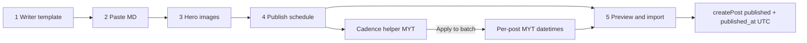

# Implementation plan: Dr Jasmine bulk import schedule UI

**Status:** Ready for implementation (2026-07-29)
**Date:** 2026-07-29
**Feature:** Port CAE Admin bulk-import schedule UI to Dr Jasmine Admin (Malaysia Time + per-batch cadence helper; no Markdown `publishAt`)

**Prerequisite:** CAE implementation is complete — use it as the source of truth. See [`cae-bulk-import-schedule-ui.md`](./cae-bulk-import-schedule-ui.md).

**Lazy publish model (unchanged):** store `status=published` + future `published_at` UTC; public visibility is a time-gate (`published_at <= now()`). **No cron / worker.** Same as CAE scheduling — see [`cae-blog-scheduling.md`](./cae-blog-scheduling.md).

---

## Locked product decisions (match CAE)

| # | Decision | Choice |
|---|----------|--------|
| 1 | Where scheduling lives | Admin Bulk Import UI only — not in the LLM/writer Markdown template |
| 2 | Timezone | Fixed **Malaysia Time** (`Asia/Kuala_Lumpur`, UTC+8; no DST) |
| 3 | Cadence helper | Per **current paste/upload batch** only (React state; not persisted) |
| 4 | Cadence math | Post 1 = chosen start date + time; post *k* = start + `(k-1) * N` days at the same clock time |
| 5 | Leftover `publishAt` in MD | **Ignore** — Admin schedule UI always wins |
| 6 | Cadence presets | **None** — no “Every day 8:00 AM” / “Every 3 days 9:00 PM” buttons; writers use Start date + Time + Every N days + Apply |
| 7 | Scope | **Dr Jasmine only** — do not change CAE files |



---

## Source of truth (CAE) → targets (Dr Jasmine)

| Role | CAE (read / copy from) | Dr Jasmine (write) |
|------|------------------------|--------------------|
| Schedule helpers | [`apps/cae/src/lib/bulk-import-schedule.ts`](../apps/cae/src/lib/bulk-import-schedule.ts) | **CREATE** `apps/dr-jasmine/src/lib/bulk-import-schedule.ts` |
| Writer / LLM template | [`apps/cae/src/lib/bulk-import-template.ts`](../apps/cae/src/lib/bulk-import-template.ts) | **UPDATE** `apps/dr-jasmine/src/lib/bulk-import-template.ts` |
| Parser | [`apps/cae/src/lib/bulk-import.ts`](../apps/cae/src/lib/bulk-import.ts) | **UPDATE** `apps/dr-jasmine/src/lib/bulk-import.ts` |
| Form island | [`apps/cae/src/components/admin/BulkImportForm.tsx`](../apps/cae/src/components/admin/BulkImportForm.tsx) | **UPDATE** `apps/dr-jasmine/src/components/admin/BulkImportForm.tsx` |
| Form CSS | [`apps/cae/src/components/admin/BulkImportForm.module.css`](../apps/cae/src/components/admin/BulkImportForm.module.css) | **UPDATE** `apps/dr-jasmine/src/components/admin/BulkImportForm.module.css` |

**Do not** wholesale-replace DJ `BulkImportForm.tsx` or `bulk-import.ts` with CAE copies. Port surgically so DJ-specific wiring survives (see below).

---

## Critical: preserve Dr Jasmine-specific code

When porting, **keep** these DJ behaviors. CAE differs; copying blindly will break cover uploads and imports.

| Concern | Dr Jasmine (keep) | CAE (do not import into DJ) |
|---------|-------------------|-----------------------------|
| Cover upload | `uploadBulkImportCoverImage` from `../../lib/bulk-import` | `uploadBlogCoverImage` from `../../lib/storage` |
| Storage prefix | `dr-jasmine/blog/covers` (inside DJ `bulk-import.ts`) | `cae/blog/covers` |
| Slug helper in form | `slugifyTitle` from `../../lib/bulk-import` | `slugifyTitle` from `../../lib/post-slug` |
| Slug in parser | `SLUG_FORMAT_PATTERN` / `slugifyTitle` defined **inside** DJ `bulk-import.ts` | imported from `./post-slug` |
| Template branding | `DR JASMINE BLOG`, Wellness / clinic copy, DJ body conventions | `CAE BLOG`, Astrology examples |
| Site id comment | `drJasmineSiteConfig.projectId` | `caeSiteConfig.projectId` |

Also leave alone: `@seo/blog` create/visibility helpers, Supabase migrations, CAE app files, shared packages.

---

## UI shape (Dr Jasmine Bulk Import)

Today DJ sections are 1–4 (preview is 4). After port, match CAE:

1. Writer template
2. Add your content (Markdown paste/upload)
3. Hero images
4. **Publish schedule** (new)
5. Preview & import (was 4)

### Section 4 — Publish schedule

Shown when `rows.length > 0`.

**Cadence helper (batch only):**

- **Start date** — post 1 calendar day
- **Time of day (MYT)** — e.g. `08:00` / `21:00`
- **Every N days** — integer ≥ 1
- **Apply to all posts** — fills every post in document order; overwrites prior UI times for this batch
- **No preset buttons**

**Per-post editors:** date + time (MYT), editable after Apply, clearable.

Hint copy: “Times are Malaysia Time (UTC+8). Cadence applies only to this import batch.”

### Import merge rule (same as CAE)

- `publishedAt` on `createPost` = UI MYT → UTC ISO via `buildMytIso`
- Never use frontmatter `publishAt`
- Future UI go-live → effective status **Scheduled** (`published` + future `published_at`), including when MD said `draft`
- `archived` from MD stays archived; ignore schedule times for archived rows
- `status: scheduled` in MD without UI time → not ready (require section 4)
- Preview “Publish at” column = `formatMytPreview` from UI state (e.g. `2026-08-05 08:00 MYT`)

---

## Task breakdown (for implementing agent)

### Task A — Schedule helpers

1. Copy [`apps/cae/src/lib/bulk-import-schedule.ts`](../apps/cae/src/lib/bulk-import-schedule.ts) → `apps/dr-jasmine/src/lib/bulk-import-schedule.ts`.
2. Change fileoverview “CAE Admin” → “Dr Jasmine Admin”.
3. Leave logic unchanged (`buildMytIso`, `applyCadenceSchedule`, `formatMytPreview`, validators).

### Task B — Writer / LLM template

Update `apps/dr-jasmine/src/lib/bulk-import-template.ts` using CAE’s **contract**, keeping DJ branding:

- Remove `OPTIONAL — publishing` `publishAt` docs and example `publishAt:` lines
- Remove AI instruction to default `status: "scheduled"` with staggered `publishAt`
- Status options: `draft | published | archived` only
- Instruct: set go-live in Admin Bulk Import **section 4** (Malaysia Time); leftover `publishAt` ignored
- Keep `DR JASMINE BLOG` header, Wellness categories/examples, DJ-specific body guidance
- Example posts: `status: "draft"` (no dates)

Reference CAE template structure in [`apps/cae/src/lib/bulk-import-template.ts`](../apps/cae/src/lib/bulk-import-template.ts).

### Task C — Parser

Update `apps/dr-jasmine/src/lib/bulk-import.ts` to match CAE ignore behavior:

- If `publishAt` / `publishedAt` present → soft **note** (“ignored — set times in section 4”); do not parse into `publishAtIso`
- Always set `publishAtIso: null` on parsed rows
- Remove `coercePublishAtIso` and errors requiring future `publishAt` when `status: scheduled`
- Keep accepting `status: scheduled` as an intent (form will require UI times)
- **Do not** remove or rewrite `uploadBulkImportCoverImage`, `DJ_BLOG_COVERS_PREFIX`, or in-file slug helpers

Mirror the relevant blocks in CAE `bulk-import.ts` (ignore note + `publishAtIso: null`).

### Task D — Form island (surgical port)

Update `apps/dr-jasmine/src/components/admin/BulkImportForm.tsx` by porting from CAE form — **do not** replace the whole file.

Port these concepts from CAE:

- Imports from `../../lib/bulk-import-schedule`
- Types: `CadenceHelperState`, `EffectivePublishState`, `DEFAULT_CADENCE`
- `resolveEffectivePublish`, `readScheduleParts`, `isRowReadyWithSchedule`, `parseIntervalDays`
- State: `scheduleByIndex`, `cadence`, `cadenceError`
- Effects: prune schedule slots when row indexes disappear (with hero prune)
- Handlers: schedule field change / clear / `handleApplyCadence` (no preset handler)
- `buildCreatePostInput(..., effective)` using `effective.publishAtIso` + `mapStatusIntentToStored(effective.statusIntent)`
- Section 4 JSX (cadence panel + per-post MYT editors) **without** preset buttons
- Section 5 preview using `formatMytPreview` + effective status label
- Help copy: quick field guide without Markdown `publishAt`

**Keep DJ imports:**

```ts
import {
  // ...existing DJ exports
  slugifyTitle,
  uploadBulkImportCoverImage,
} from "../../lib/bulk-import";
```

Keep calling `uploadBulkImportCoverImage(client, attachedFile)` on import.

Update fileoverview/props comments for section 4 scheduling if needed; keep Dr Jasmine naming.

### Task E — CSS

Append CAE cadence/schedule rules onto `apps/dr-jasmine/src/components/admin/BulkImportForm.module.css`:

- `.cadencePanel`, `.cadenceTitle`, `.cadenceFields`, `.cadenceApplyWrap`
- `.scheduleRow`, `.scheduleInput`, `.scheduleInput:focus`

Do **not** add `.cadencePresets` (presets removed on CAE).

Copy from CAE module after `.heroSlotFilename` (or equivalent). Leave existing DJ rules intact.

### Task F — Verify

1. `npx tsc --noEmit -p tsconfig.json` in `apps/dr-jasmine`
2. Confirm CAE files untouched (`git status` / diff scope)
3. Manual Admin smoke on `/dr-jasmine/admin/posts/import`:
   - Copy template → no `publishAt` field
   - Paste multi-post MD (with leftover `publishAt` optional) → note may appear; times from section 4 only
   - Cadence: start `2026-08-05`, time `08:00`, every `1` day × 3 posts → Aug 5/6/7 08:00 MYT
   - Every `3` days `21:00` → Aug 5/8/11 21:00 MYT
   - Stored UTC: `00:00Z` for 08:00 MYT; `13:00Z` for 21:00 MYT
   - Re-paste / change document → schedule slots for removed indexes drop
   - Import → Admin Scheduled tab; public hidden until due (lazy gate)

Optional quick MYT math check (from `apps/dr-jasmine`):

```bash
node --experimental-strip-types --input-type=module -e "import { applyCadenceSchedule, buildMytIso, formatMytPreview } from './src/lib/bulk-import-schedule.ts'; console.log(applyCadenceSchedule({ startDate: '2026-08-05', timeOfDay: '08:00', intervalDays: 1, postCount: 3 }).map(s => [formatMytPreview(s), buildMytIso(s.dateYmd, s.timeHm)]))"
```

---

## Out of scope

- Changing CAE Admin or CAE lib files
- Extracting shared `@seo/blog` bulk-import package (keep per-app duplication for now)
- Refactoring DJ cover upload into `storage.ts` / slug into `post-slug.ts` (unless needed for compile; prefer leave as-is)
- Cron / eager status flip
- Persisted cadence presets or site-wide defaults
- Updating draft Markdown under `docs/blog/dr-jasmine/blog-draft/` (optional cleanup; not required for Admin feature)

---

## Acceptance criteria

- [ ] DJ writer template has no `publishAt:` example and no AI “stagger publishAt” instruction
- [ ] DJ parser ignores leftover `publishAt` (soft note); `publishAtIso` always null from parse
- [ ] Bulk Import sections are 1–5 with **4. Publish schedule** (MYT cadence + per-post editors, no presets)
- [ ] Import uses UI schedule → UTC `published_at`; never MD `publishAt`
- [ ] Cadence math matches CAE acceptance (daily 08:00 / every-3-days 21:00 UTC conversions)
- [ ] DJ cover upload still works (`uploadBulkImportCoverImage` / `dr-jasmine/blog/covers`)
- [ ] CAE app unchanged
- [ ] `apps/dr-jasmine` typecheck passes

---

## Agent working notes

1. Read CAE files first; treat them as the behavioral spec.
2. Port surgically; never overwrite DJ form/parser wholesale.
3. No preset buttons (CAE already removed them — match that UX).
4. Strict TypeScript: no `any`, no non-null assertions, no `as unknown as T`; double quotes for strings.
5. Do not edit this plan’s locked decisions unless the user changes product requirements.
