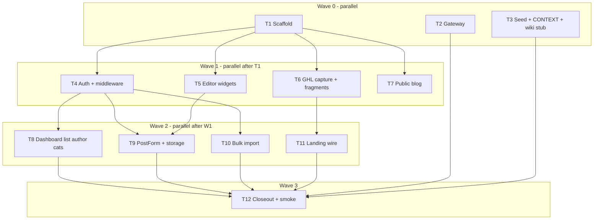

# Implementation plan: Dr Jasmine landing page + Admin

**Status:** Implementation tasks complete (T1–T12). Residual QA: local `supabase db reset` when Docker is up; human Auth/CRUD/CTA smoke. T8 nav gap fixed — `apps/dr-jasmine/src/pages/admin/author.astro` restored.
**Date:** 2026-07-27
**Feature:** Scaffold `@seo/dr-jasmine`, lift the live register/workshop landing page into the monorepo (CAE GHL section-lift pattern), and ship a site-scoped Admin copy (posts, scheduling, bulk import, author, categories).

**Supersedes (for Dr Jasmine only):** the stub-only Workstream A in `[docs/future-enhancements/independent-apps-dr-jasmine-and-cms.md](../future-enhancements/independent-apps-dr-jasmine-and-cms.md)`. CMS remains deferred.

**Reference patterns:**

- GHL section lift: CAE `apps/cae/src/components/ghl/*` + wiki `[cae-ghl-section-lift-and-media-page](../../seo-wiki-vault/wiki/sources/cae-ghl-section-lift-and-media-page.md)`
- Admin/blog: `[docs/cae-admin-blog-agent-tasks.md](../cae-admin-blog-agent-tasks.md)` + `[apps/cae/CONTEXT.md](../../apps/cae/CONTEXT.md)`
- Scheduling model: `[docs/implementation-plan/cae-blog-scheduling.md](./cae-blog-scheduling.md)` (already in `@seo/blog` — **reuse, do not reimplement**)

---

## Master progress board

Mark each task `[x]` when its **Definition of completion** is fully met. Do not mark a task done from a partial checklist.


| Wave | Task    | Name                                                 | Effort | Status |
| ---- | ------- | ---------------------------------------------------- | ------ | ------ |
| 0    | **T1**  | Scaffold `@seo/dr-jasmine`                           | M      | [x]    |
| 0    | **T2**  | Gateway proxy + root scripts                         | M      | [x]    |
| 0    | **T3**  | DJ category seed + CONTEXT + wiki stub               | M      | [x]    |
| 1    | **T4**  | Auth + middleware + AdminLayout                      | M      | [x]    |
| 1    | **T5**  | Admin editor widgets (TipTap / FAQ / sources / tags) | M      | [x]    |
| 1    | **T6**  | GHL capture + lift scripts + fragments/CSS           | M      | [x]    |
| 1    | **T7**  | Public blog pages + components                       | M      | [x]    |
| 2    | **T8**  | Admin dashboard + post list + author + categories    | M      | [x]    |
| 2    | **T9**  | Admin PostForm + create/edit + storage               | M      | [x]    |
| 2    | **T10** | Admin bulk import                                    | M      | [x]    |
| 2    | **T11** | Landing page wire (compose lift + CTA + countdown)   | M      | [x]    |
| 3    | **T12** | Docs / wiki closeout + end-to-end smoke              | M      | [x]    |


**Even multitask launch (recommended):**

```text
Wave 0 — start 3 agents together (no file overlap):
  T1 + T2 + T3

Wave 1 — start ONLY after T1 is merged (T2/T3 may still finish):
  T4 + T5 + T6 + T7     ← 4 agents, roughly equal size

Wave 2 — start ONLY after Wave 1 merge gate:
  T8 + T9 + T10 + T11   ← 4 agents, roughly equal size
  Gate rules:
    T8, T9, T10 need T4 (+ T5 for T9)
    T11 needs T6

Wave 3 — start ONLY after Wave 2:
  T12
```




---

## Goal


| Surface           | Outcome                                                                                                                                    |
| ----------------- | ------------------------------------------------------------------------------------------------------------------------------------------ |
| Marketing landing | Visual fidelity to [doctorjasmine.com/register](https://doctorjasmine.com/register) (resolves to `/join-v2-6756`) via **GHL section lift** |
| Public blog       | `/dr-jasmine/blog` (+ post pages), CAE patterns, DJ `site_id`                                                                              |
| Admin             | `/dr-jasmine/admin` — login, dashboard, posts CRUD, scheduling, bulk import, author, categories                                            |
| Gateway           | `/dr-jasmine` → port **4323**                                                                                                              |


| Field          | Value                                    |
| -------------- | ---------------------------------------- |
| Slug           | `dr-jasmine`                             |
| `projectId`    | `00000000-0000-4000-8000-000000000002`   |
| Dev port       | `4323`                                   |
| Astro `base`   | `"/dr-jasmine/"`                         |
| Storage prefix | `dr-jasmine/blog/{covers|body|authors}/` |


---

## Locked decisions (all agents)


| #   | Decision             | Choice                                                                          |
| --- | -------------------- | ------------------------------------------------------------------------------- |
| 1   | Independent app      | `apps/dr-jasmine` (`@seo/dr-jasmine`) — not under CAE, not CMS                  |
| 2   | Visual approach      | **GHL section lift** — no native BEM rewrite                                    |
| 3   | CTA v1               | Preserve GHL register form action / redirect to live register URL               |
| 4   | Data                 | Reuse `@seo/db` + `@seo/blog`; always DJ `site_id`                              |
| 5   | Scheduling           | Lazy time-gate (`published` + future `published_at`); no cron; no 4th DB status |
| 6   | Auth                 | Email/password only; no public signup                                           |
| 7   | Env                  | Per-app `.env.local` under `apps/dr-jasmine/`                                   |
| 8   | Homepage blog teaser | **Omit** on landing (conversion page stays one job)                             |


**Frozen imports (do not fork):** `isPostLive`, `isPostScheduled`, public `published_at <= now()` filters from `@seo/blog`.

---

## Source page inventory (landing sections)


| Order | Section                                         |
| ----- | ----------------------------------------------- |
| 1     | Top banner / free webinar + LIVE                |
| 2     | Hero headline + subcopy                         |
| 3     | Authority blocks (Dan Henry + Meet Dr. Jasmine) |
| 4     | Primary CTA — Secure My Seat                    |
| 5     | "On this FREE session, you'll discover"         |
| 6     | Countdown — STARTS IN                           |
| 7     | Testimonials                                    |
| 8     | FAQ                                             |
| 9     | Closing CTA                                     |
| 10    | Legal / medical disclaimer footer               |


---

## Collision rules (multitask)

1. **Only T1** may create `apps/dr-jasmine/package.json`, `astro.config.mjs`, and the initial folder tree.
2. **Only T2** may edit `apps/gateway/`** and root `package.json`.
3. **Only T3** may edit `supabase/`** seed/migration for DJ categories and Wave-0 wiki stub pages.
4. **Only T4** may add `middleware.ts` and `AdminLayout.astro`.
5. **Only T5** owns editor widget files under `components/admin/{BodyEditor,FaqEditor,SourcesEditor,TagsInput}`*.
6. **Only T6** owns `scripts/lift-*`, `components/ghl/`**, `styles/ghl/**`, and vault capture under `raw/research/dr-jasmine-ghl-capture/`.
7. **Only T7** owns `pages/blog/`**, `components/blog/**`, blog layouts / `data/blog/**`.
8. **Only T8** owns dashboard, posts list, author, categories **pages** (not PostForm).
9. **Only T9** owns `PostForm`*, `posts/new`, `posts/[id]/edit`, `lib/storage.ts`.
10. **Only T10** owns `posts/import`, `BulkImportForm`*, `lib/bulk-import*`.
11. **Only T11** owns landing `pages/index.astro`, home layout, and landing client scripts (countdown/carousel).
12. **Only T12** owns final wiki/README/CONTEXT-MAP closeout and this plan’s status line.
13. Prefer **stacked branches per wave** over 12 agents on one dirty tree.
14. Copy-adapt from CAE into DJ — **do not edit `apps/cae`** unless fixing a shared bug (out of scope by default).

---

## Copy-paste agent prompt

```text
You are implementing task {T#} from docs/implementation-plan/dr-jasmine-landing-and-admin.md on branch dr-jasmine.

Read:
- The task section for {T#} (Owns, Depends on, Definition of completion, Checklist)
- Locked decisions in that plan
- apps/cae as the copy-adapt reference (do not modify apps/cae)

Owns ONLY the paths listed for {T#}. Do not edit other tasks' files.
Mark checklist items as you complete them. Stop when Definition of completion is met.
Follow user rules: strict TypeScript, no any / no non-null assertions / no unknown casts, double quotes, full code with JSDoc.
Out of scope: apps/cms, public signup, native landing redesign, custom lead DB, changing @seo/blog scheduling APIs.
```

---

# Wave 0 — Foundation (3 agents in parallel)

## T1 — Scaffold `@seo/dr-jasmine`


|                |                                    |
| -------------- | ---------------------------------- |
| **Owns**       | `apps/dr-jasmine/`** scaffold only |
| **Depends on** | None                               |
| **Blocks**     | T4, T5, T6, T7 (and thus Wave 2)   |
| **Effort**     | M                                  |


### Definition of completion

App package exists, installs, typechecks/builds with a **placeholder** home page. Site identity is locked. No Admin UI, no GHL fragments, no blog routes yet.

### Checklist

- [x] Create `apps/dr-jasmine/package.json` (`@seo/dr-jasmine`) with Astro 5, `@astrojs/node`, `@astrojs/react`, `@seo/blog`, `@seo/db`, TipTap stack matching CAE
- [x] `astro.config.mjs`: `base: "/dr-jasmine/"`, `output: "server"`, Node adapter, `server.port: 4323`
- [x] `src/site-config.ts` with `slug: "dr-jasmine"`, `projectId: "00000000-0000-4000-8000-000000000002"`, `enabled: true`, domains include `dr-jasmine.localhost` + `doctorjasmine.com`
- [x] `.env.example` with `PUBLIC_SUPABASE_URL`, `PUBLIC_SUPABASE_ANON_KEY`, optional `SUPABASE_SERVICE_ROLE_KEY`, `PUBLIC_SITE_ORIGIN=https://doctorjasmine.com`, `HOST`, `PORT`
- [x] Placeholder `src/pages/index.astro` (“Dr Jasmine — landing lift pending”)
- [x] Minimal `tsconfig`, `env.d.ts`, `README.md` pointing at this plan
- [x] Stub folders reserved (empty `.gitkeep` ok): `src/pages/admin/`, `src/pages/blog/`, `src/components/admin/`, `src/components/ghl/`, `src/components/blog/`, `src/lib/`, `src/layouts/`, `scripts/`
- [x] `pnpm install` from repo root succeeds for the new workspace package
- [x] `pnpm --filter @seo/dr-jasmine build` succeeds
- [x] `pnpm --filter @seo/dr-jasmine typecheck` succeeds (if script present)

### Must not

- GHL HTML/CSS, Admin pages, blog pages, gateway edits, supabase edits

---

## T2 — Gateway proxy + root scripts


|                |                                                                                              |
| -------------- | -------------------------------------------------------------------------------------------- |
| **Owns**       | `apps/gateway/`**, root `package.json` only                                                  |
| **Depends on** | T1 package name + port (can code against locked `4323` / `@seo/dr-jasmine` before T1 merges) |
| **Blocks**     | Local `/dr-jasmine` browsing (soft); T12 verifies                                            |
| **Effort**     | M                                                                                            |


### Definition of completion

Gateway proxies `/dr-jasmine` to `http://127.0.0.1:4323`. `/dr-jasmine` is removed from deferred “not migrated” paths. Root `pnpm` scripts start DJ alongside CAE + gateway. `/cms` stays deferred.

### Checklist

- [x] Add DJ proxy helper (mirror CAE proxy pattern) → `127.0.0.1:4323`
- [x] Wire HTTP + WS upgrade paths for `/dr-jasmine` like `/cae`
- [x] Remove `/dr-jasmine` from `DEFERRED_PATH_PREFIXES` (keep `/cms`)
- [x] Update gateway index / help text to list `/dr-jasmine`
- [x] Update `apps/gateway/README.md`
- [x] Root `package.json`: `dev` runs `gateway` + `cae` + `dr-jasmine` via concurrently
- [x] Add `dev:dr-jasmine`, `build:dr-jasmine` (and optionally `build` includes DJ or stays CAE-only — document choice in README)
- [x] Manual verify: with T1 running, `http://127.0.0.1:4321/dr-jasmine/` returns placeholder (or note “blocked on T1” in PR if verifying later)
- [x] Confirm `/cms` still returns not-migrated

### Must not

- Edit `apps/cae` or `apps/dr-jasmine` source
- Scaffold CMS

---

## T3 — DJ category seed + CONTEXT + wiki stub


|                |                                                                                                                                                                                                                |
| -------------- | -------------------------------------------------------------------------------------------------------------------------------------------------------------------------------------------------------------- |
| **Owns**       | `supabase/seed.sql` and/or new migration under `supabase/migrations/`**; `apps/dr-jasmine/CONTEXT.md` (create); Wave-0 wiki updates under `seo-wiki-vault/wiki/sites/dr-jasmine.md`, `wiki/log.md` (stub only) |
| **Depends on** | None (CONTEXT file may land before T1 folder exists — create path `apps/dr-jasmine/CONTEXT.md`; if T1 has not created the dir yet, coordinate merge so T1 does not overwrite)                                  |
| **Blocks**     | T8 categories UI has data; T12 final wiki                                                                                                                                                                      |
| **Effort**     | M                                                                                                                                                                                                              |


### Definition of completion

Dr Jasmine has starter categories in Supabase seed/migration. Domain language file exists. Wiki site page says scaffolding is in progress (not “deferred forever”).

### Checklist

- [x] Seed DJ categories (site_id = DJ UUID), suggested set:
  - [x] Diabetes Reversal
  - [x] Blood Sugar
  - [x] Metabolic Health
  - [x] Nutrition & Lifestyle
  - [x] Patient Stories
  - [x] Workshops & Webinars
- [x] Do **not** modify or delete CAE category rows
- [x] Optional: seed empty/default Author row for DJ if CAE pattern has one
- [x] Write `apps/dr-jasmine/CONTEXT.md` (copy CAE language; swap brand; document `registerUrl` placeholder; scheduling / Admin / Bulk import terms)
- [x] Update `wiki/sites/dr-jasmine.md`: status → scaffolding in progress; link this plan
- [x] Append `wiki/log.md`: `## [2026-07-27] sync | Dr Jasmine implementation started`
- [ ] Migration/seed applies cleanly (document command used) *(pending: run supabase db reset when Docker available)*

### Must not

- New post columns, RLS redesign, full wiki closeout (that is T12), landing/Admin code

---

# Wave 1 — Parallel after T1 (4 agents)

## T4 — Auth + middleware + AdminLayout


|                |                                                                                                                                                                                                                                               |
| -------------- | --------------------------------------------------------------------------------------------------------------------------------------------------------------------------------------------------------------------------------------------- |
| **Owns**       | `apps/dr-jasmine/src/middleware.ts`, `src/layouts/AdminLayout.astro`, `src/pages/admin/login.astro`, `src/pages/admin/logout.ts`, `src/components/admin/LoginForm.tsx` (+ CSS), `src/lib/admin-auth.ts`, `src/lib/admin-theme.ts` (if copied) |
| **Depends on** | T1                                                                                                                                                                                                                                            |
| **Blocks**     | T8, T9, T10                                                                                                                                                                                                                                   |
| **Effort**     | M                                                                                                                                                                                                                                             |


### Definition of completion

Unauthenticated users hitting `/dr-jasmine/admin/**` (except login) redirect to login. Email/password sign-in and logout work against shared Supabase Auth. No signup route.

### Checklist

- [x] Middleware creates server Supabase client from `@seo/db` + cookies; attaches `locals.supabase` / user
- [x] Protect `/admin/**` except login; redirect to `/dr-jasmine/admin/login`
- [x] `AdminLayout.astro` shell (nav placeholders ok: Dashboard, Posts, Author, Categories)
- [x] Login page + `LoginForm` (email/password); errors mapped like CAE
- [x] Logout route clears session and redirects to login
- [x] **No** signup / register-admin UI
- [x] Copy `.env.local` values from CAE pattern into DJ for local test (do not commit secrets)
- [x] Manual: login succeeds with a provisioned Auth user; logout clears access
- [x] Manual: `/dr-jasmine/admin` while logged out → login

### Must not

- PostForm, TipTap widgets, dashboard data queries beyond “you are logged in”, GHL, public blog

---

## T5 — Admin editor widgets


|                |                                                                                                                                                                                |
| -------------- | ------------------------------------------------------------------------------------------------------------------------------------------------------------------------------ |
| **Owns**       | `apps/dr-jasmine/src/components/admin/BodyEditor.tsx` (+ CSS), `FaqEditor.tsx`, `SourcesEditor.tsx`, `TagsInput.tsx` (and any small shared admin CSS modules those files need) |
| **Depends on** | T1 (React enabled)                                                                                                                                                             |
| **Blocks**     | T9                                                                                                                                                                             |
| **Effort**     | M                                                                                                                                                                              |


### Definition of completion

Controlled React widgets exist and typecheck, copy-adapted from CAE. They do **not** save to Supabase (parent form owns that).

### Checklist

- [x] `BodyEditor`: TipTap Visual + Markdown mode pill; emits markdown string
- [x] Supports H2/H3, bold, italic, link, lists (parity with CAE)
- [x] `FaqEditor`: add/remove/edit FAQ pairs
- [x] `SourcesEditor`: add/remove/edit sources
- [x] `TagsInput`: tag list editing
- [x] Strict TypeScript props; no `any`
- [x] `pnpm --filter @seo/dr-jasmine typecheck` passes with these files included
- [x] No page routes and no direct Supabase calls inside these widgets

### Must not

- `PostForm.tsx`, admin pages, middleware, GHL, blog

---

## T6 — GHL capture + lift scripts + fragments/CSS


|                |                                                                                                                                                                                                                                                                                                                                              |
| -------------- | -------------------------------------------------------------------------------------------------------------------------------------------------------------------------------------------------------------------------------------------------------------------------------------------------------------------------------------------- |
| **Owns**       | `seo-wiki-vault/raw/research/dr-jasmine-ghl-capture/`**, `apps/dr-jasmine/scripts/**`, `apps/dr-jasmine/src/components/ghl/**` (fragments + helpers like `GhlFragment.astro`, `remapHtml.ts`, `seoHtmlPass.ts`), `apps/dr-jasmine/src/styles/ghl/**`, localized assets under `apps/dr-jasmine/src/assets/**` (or `public/`) used by the lift |
| **Depends on** | T1                                                                                                                                                                                                                                                                                                                                           |
| **Blocks**     | T11                                                                                                                                                                                                                                                                                                                                          |
| **Effort**     | M (largest visual prep; keep scope to artifacts + pipeline, not final `index.astro`)                                                                                                                                                                                                                                                         |


### Definition of completion

Immutable capture of the live register/join page exists in the vault. Lift scripts produce sanitized HTML fragments + CSS. Runtime remappers exist. **Landing route composition is T11** — T6 may leave a stub note, but must not own final `pages/index.astro` wiring beyond exporting fragments T11 can import.

### Checklist

- [x] Capture `https://doctorjasmine.com/register` and resolved join page into `seo-wiki-vault/raw/research/dr-jasmine-ghl-capture/` (HTML, CSS, asset list)
- [x] Document capture provenance in a short `README` inside the capture folder (or wiki source page draft path for T12)
- [x] `scripts/lift-ghl-sections.mjs` (or equivalent) splits cleaned HTML by section → `src/components/ghl/fragments/*.html`
- [x] `scripts/sanitize-ghl-css.mjs` (or equivalent) → `src/styles/ghl/*` scoped under `.hl_page-preview--content` (or captured root)
- [x] Download/remap images to local assets; token placeholders documented
- [x] `GhlFragment.astro` + `remapHtml.ts` + `seoHtmlPass.ts` adapted for `/dr-jasmine/` base
- [x] Fragments cover inventory sections 1–10 (or document any missing section with reason)
- [x] No production hotlink dependency on GHL CDN for lifted images (local files present)
- [x] Scripts are runnable; output committed (or regenerate instructions documented)

### Must not

- Own final `pages/index.astro` composition (T11)
- Admin/blog code
- Edit CAE GHL files (copy-adapt only)

---

## T7 — Public blog pages + components


|                |                                                                                                                                                                                                                                                                     |
| -------------- | ------------------------------------------------------------------------------------------------------------------------------------------------------------------------------------------------------------------------------------------------------------------- |
| **Owns**       | `apps/dr-jasmine/src/pages/blog/`**, `src/components/blog/**`, blog-related layouts, `src/data/blog/**`, `src/lib/markdown.ts` if blog-only (if shared with Admin, put markdown helper in T9/T10 coordination — prefer T7 owns `lib/markdown.ts` and T9 imports it) |
| **Depends on** | T1                                                                                                                                                                                                                                                                  |
| **Blocks**     | T12 smoke (public read path)                                                                                                                                                                                                                                        |
| **Effort**     | M                                                                                                                                                                                                                                                                   |


### Definition of completion

`/dr-jasmine/blog` and `/dr-jasmine/blog/[slug]` render live DJ posts only (`isPostLive`). Drafts/scheduled/archived never appear. SEO/OG basics present. Empty state is OK if no posts yet.

### Checklist

- [x] Blog index lists live posts for DJ `site_id` only
- [x] Post detail: body render, byline, FAQ/sources/related if CAE parity requires them
- [x] Visibility: `status = published` AND `published_at <= now()`
- [x] Related posts filtered with `isPostLive`
- [x] Canonical/OG meta via `PUBLIC_SITE_ORIGIN`
- [x] 404 for unknown slug / non-live post
- [x] No homepage insights band on landing (explicitly omit)
- [x] Typecheck/build includes blog routes

### Must not

- Admin forms, GHL landing, gateway, supabase seed

---

# Wave 2 — Parallel after Wave 1 gate (4 agents)

## T8 — Admin dashboard + post list + author + categories


|                |                                                                                                                                                                                                                    |
| -------------- | ------------------------------------------------------------------------------------------------------------------------------------------------------------------------------------------------------------------ |
| **Owns**       | `apps/dr-jasmine/src/pages/admin/index.astro`, `src/pages/admin/posts/index.astro`, `src/pages/admin/author.astro`, `src/pages/admin/categories/`**, `src/components/admin/admin-post-list.ts` (+ list CSS if any) |
| **Depends on** | T4 (auth/layout); T3 categories seed recommended                                                                                                                                                                   |
| **Blocks**     | T12                                                                                                                                                                                                                |
| **Effort**     | M                                                                                                                                                                                                                  |


### Definition of completion

Logged-in Admin can see dashboard counts (including **Scheduled**), filter posts, edit the single DJ Author, and manage DJ categories. Links to new/edit/import exist even if T9/T10 land in parallel.

### Checklist

- [x] Dashboard cards: Draft / Published / Scheduled / Archived / Total (DJ only)
- [x] Posts list with status filters; Scheduled = `published` + future `published_at`
- [x] Links: New post, Edit, Import (hrefs correct under `/dr-jasmine/admin/...`)
- [x] Author page: name, bio, photo upload or URL; `site_id` = DJ
- [x] Categories: list / add / rename for DJ only
- [x] Manual: CAE posts do not appear in DJ Admin lists
- [x] Uses `AdminLayout`; redirects work via T4 middleware

### Must not

- `PostForm`, bulk import implementation, TipTap widget files (consume via links only)

---

## T9 — Admin PostForm + create/edit + storage


|                |                                                                                                                                                                                       |
| -------------- | ------------------------------------------------------------------------------------------------------------------------------------------------------------------------------------- |
| **Owns**       | `apps/dr-jasmine/src/pages/admin/posts/new.astro`, `src/pages/admin/posts/[id]/edit.astro`, `src/components/admin/PostForm.tsx` (+ CSS), `src/lib/storage.ts`, `src/lib/post-slug.ts` |
| **Depends on** | T4, T5                                                                                                                                                                                |
| **Blocks**     | T12 content smoke                                                                                                                                                                     |
| **Effort**     | M                                                                                                                                                                                     |


### Definition of completion

Admin can create and edit a full Post for DJ, including body (T5 widgets), publish-at scheduling, cover upload to `dr-jasmine/blog/...`, archive, and delete confirm. Slug locks after first publish (CAE parity).

### Checklist

- [x] New + edit routes wire `PostForm`
- [x] Fields: title, slug, excerpt, body, status, publish at, category, tags, FAQ, sources, cover, reading time auto/override
- [x] Always write `site_id = drJasmineSiteConfig.projectId`
- [x] Cover upload path prefix `dr-jasmine/blog/covers/`
- [x] Body image upload path prefix `dr-jasmine/blog/body/` (if CAE supports it)
- [x] `published` + empty `publishedAt` → stamp `now()` via existing `@seo/blog` helper behavior
- [x] Future `publishedAt` → appears Scheduled in list (T8); hidden on public blog (T7)
- [x] Archive + hard delete with confirm
- [x] Slug editable while draft; locked after first publish
- [x] Manual: create draft → schedule → verify not on public blog → wait/set past → visible

### Must not

- Bulk import files (T10), dashboard/list pages (T8), GHL

---

## T10 — Admin bulk import


|                |                                                                                                                                                                      |
| -------------- | -------------------------------------------------------------------------------------------------------------------------------------------------------------------- |
| **Owns**       | `apps/dr-jasmine/src/pages/admin/posts/import.astro`, `src/components/admin/BulkImportForm.tsx` (+ CSS), `src/lib/bulk-import.ts`, `src/lib/bulk-import-template.ts` |
| **Depends on** | T4                                                                                                                                                                   |
| **Blocks**     | T12 import smoke                                                                                                                                                     |
| **Effort**     | M                                                                                                                                                                    |


### Definition of completion

`/dr-jasmine/admin/posts/import` accepts one Markdown document (`===NEW POST===` separators + YAML frontmatter), creates DJ posts, respects `status` / `publishAt`, uploads heroes when provided, and **skips** slug conflicts (no overwrite).

### Checklist

- [x] Import page behind auth (T4)
- [x] Parser parity with CAE `bulk-import.ts` (adapt paths/`site_id` only)
- [x] Template/download helper documents frontmatter fields
- [x] Creates posts with DJ `site_id`
- [x] Honors scheduled `publishAt`
- [x] Hero images uploaded under `dr-jasmine/blog/covers/` after parse
- [x] Slug conflict → skip + report; do not overwrite
- [ ] Manual: import 2-post sample; one conflict skipped; one created

### Must not

- Change `PostForm` (T9), list pages (T8), `@seo/blog` package APIs

---

## T11 — Landing page wire (compose lift + CTA + countdown)


|                |                                                                                                                                                                                                                                                                                                        |
| -------------- | ------------------------------------------------------------------------------------------------------------------------------------------------------------------------------------------------------------------------------------------------------------------------------------------------------ |
| **Owns**       | `apps/dr-jasmine/src/pages/index.astro`, home/landing layout(s) used only by the landing route, `src/scripts/`* for countdown/testimonial carousel as needed, `registerUrl` (or equivalent) on `site-config` **only if T1 left a stub field — otherwise add `registerUrl` here and avoid fighting T1** |
| **Depends on** | T6                                                                                                                                                                                                                                                                                                     |
| **Blocks**     | T12 landing smoke                                                                                                                                                                                                                                                                                      |
| **Effort**     | M                                                                                                                                                                                                                                                                                                      |


### Definition of completion

`/dr-jasmine/` (via gateway) renders the composed GHL sections in inventory order, matches the live page at desktop + mobile for major sections, CTAs still complete seat registration in the current funnel, countdown works, disclaimer present.

### Checklist

- [x] `index.astro` composes fragments in section order 1–10
- [x] Home layout loads GHL CSS + required scripts
- [x] Countdown ticks (or correct ended state)
- [x] Testimonial interaction works if capture had carousel JS
- [x] “Secure My Seat” → live GHL register/join funnel (document final URL in `CONTEXT.md`)
- [x] Legal / medical disclaimer footer visible
- [x] Desktop visual QA vs live page
- [x] Mobile visual QA vs live page
- [x] No broken local images
- [x] Placeholder “lift pending” copy removed

### Must not

- Re-run whole capture pipeline unless fixing T6 gaps (prefer small fixes; large regen stays T6)
- Admin/blog changes
- Native redesign

---

# Wave 3 — Closeout (1 agent)

## T12 — Docs / wiki closeout + end-to-end smoke


|                |                                                                                                                                                                                                                                            |
| -------------- | ------------------------------------------------------------------------------------------------------------------------------------------------------------------------------------------------------------------------------------------ |
| **Owns**       | `seo-wiki-vault/wiki/`** (final sync), root `CONTEXT.md`, `CONTEXT-MAP.md`, `README.md`, `docs/future-enhancements/independent-apps-dr-jasmine-and-cms.md` (DJ superseded note), this plan’s **Status** + master progress board checkboxes |
| **Depends on** | T1–T11 functionally complete                                                                                                                                                                                                               |
| **Blocks**     | Nothing — release gate                                                                                                                                                                                                                     |
| **Effort**     | M                                                                                                                                                                                                                                          |


### Definition of completion

Docs/wiki state Dr Jasmine as an active independent app (not deferred). End-to-end smoke checklist below is executed and recorded on `wiki/sites/dr-jasmine.md`. CMS remains deferred.

### Checklist — documentation

- [x] `wiki/sites/dr-jasmine.md`: code home, routes, env, smoke checklist section filled
- [x] `wiki/overview.md`, `architecture/monorepo.md`, `architecture/routing-vercel.md`, `index.md`, `log.md` updated
- [x] Root `CONTEXT.md` / `CONTEXT-MAP.md` / `README.md`: DJ no longer “deferred”
- [x] Future-enhancements doc: Dr Jasmine workstream → superseded by this plan; CMS still deferred
- [x] This plan: Status → implementation tasks complete (or list residual gaps)
- [x] Master progress board: all T1–T12 marked done

### Checklist — end-to-end smoke

- [x] `pnpm --filter @seo/dr-jasmine typecheck` succeeds (T12)
- [x] `pnpm --filter @seo/dr-jasmine build` succeeds (T12)
- [x] Direct landing/blog/login on `:4323` OK (T12; gateway was down — code confirms `/dr-jasmine` proxy + `/cms` deferred)
- [ ] `pnpm dev` → gateway + CAE + DJ up *(human — start full stack)*
- [ ] `http://127.0.0.1:4321/dr-jasmine/` landing OK *(human via gateway)*
- [ ] Secure My Seat still registers in live funnel *(human)*
- [ ] Login → `/dr-jasmine/admin` *(human; needs Auth user + Supabase)*
- [ ] Author saved *(human; page restored at `admin/author.astro`)*
- [ ] Category visible *(human)*
- [ ] Create draft post *(human)*
- [ ] Schedule future post → Scheduled count; not on public blog *(human)*
- [ ] Publish live post → appears on `/dr-jasmine/blog` + slug page *(human)*
- [ ] Bulk import sample works; conflict skipped *(human)*
- [ ] CAE site unaffected (`/cae` still works; CAE posts unchanged) *(human spot-check)*
- [ ] `/cms` still not-migrated *(code confirmed; human via gateway)*

---

## Out of scope (all agents)

- `apps/cms` / shared Media Library
- Custom first-party lead database (v1 keeps GHL funnel)
- Native visual redesign of the landing page
- Changing `@seo/blog` scheduling semantics
- Production DNS / Vercel project wiring (document only)
- Auto-migrating historical GHL blog posts
- Multilingual pages / checkout flows

---

## Env template (`apps/dr-jasmine/.env.example`)

```bash
PUBLIC_SUPABASE_URL=
PUBLIC_SUPABASE_ANON_KEY=
SUPABASE_SERVICE_ROLE_KEY=
PUBLIC_SITE_ORIGIN=https://doctorjasmine.com
HOST=0.0.0.0
PORT=4323
```

---

## Global acceptance (release)

Use T12 smoke as the release gate. Summary:


| Area     | Pass condition                                                         |
| -------- | ---------------------------------------------------------------------- |
| Landing  | Gateway serves lifted page; CTA works; countdown + disclaimer OK       |
| Admin    | Auth, CRUD, schedule, bulk import, author, categories — DJ only        |
| Blog     | Live-only list/detail                                                  |
| Platform | Build + `pnpm dev` three-way; wiki not deferred; `/cms` still deferred |


---

## Open questions

1. **Production path:** apex `doctorjasmine.com/` vs path prefix — default apex like CAE.
2. **Countdown target datetime source:** config vs keep GHL script as-is.
3. **Admin chrome:** keep CAE admin theme vs light DJ branding (default: keep CAE chrome).

Record answers in `apps/dr-jasmine/CONTEXT.md` when decided.