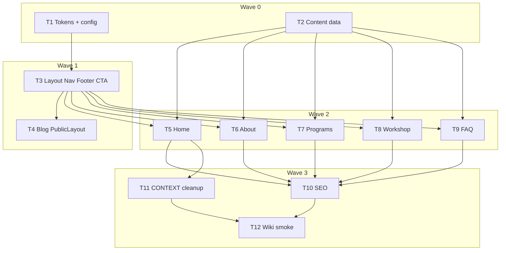

# Plan: Dr Jasmine — registration LDP → true doctor website (Option A)

**Status:** Implementation complete (T1–T12). Residual human QA: desktop/mobile brand-test on home + workshop; Auth/CRUD/publish smoke; `supabase db reset` when Docker is up.
**Date:** 2026-07-27
**Branch:** `dr-jasmine`
**Depends on:** [dr-jasmine-landing-and-admin.md](./dr-jasmine-landing-and-admin.md) (Admin/blog already shipped)

---

## Locked decisions

| # | Decision | Choice |
|---|----------|--------|
| 1 | Design direction | **Option A — Clinical Trust** |
| 2 | Home | Calm brand home — **not** GHL LDP |
| 3 | Conversion | Native **`/workshop`** → CTA continues to GHL `registerUrl` |
| 4 | Primary CTA label | **“Join free workshop”** (nav + home); Workshop may also say “Secure my seat” at GHL handoff |
| 5 | Framing | International education brand + soft SEA credibility |
| 6 | Phone / email | **None in v1** — social + workshop CTA only |
| 7 | Dan Henry | **Workshop-only** |
| 8 | Visual defaults | Soft sage + deep teal; **Fraunces** (display) + **DM Sans** (body) |
| 9 | Social | Instagram + LinkedIn (below) |
| 10 | Admin / blog model | Unchanged |

| Network | URL |
|---------|-----|
| Instagram | https://www.instagram.com/drjasminechiew/ |
| LinkedIn | https://www.linkedin.com/in/jasmine-chiew-glider2626?originalSubdomain=my |

**Preserve funnel:** `drJasmineSiteConfig.registerUrl` → `https://doctorjasmine.com/register`  
**Do not:** edit `apps/cae`, scaffold CMS, change `@seo/blog` APIs, replace GHL form with first-party leads DB.

---

## Goal (Option A homepage story)

1. Hero — brand + one promise + CTA + doctor photo  
2. Who it’s for — problem statement  
3. How we help — 3 pillars (Find trigger / Fix driver / Steady numbers)  
4. Meet Dr Jasmine — credentials  
5. Proof — 3–4 curated testimonials  
6. Latest blog — 3 live posts  
7. Workshop CTA band  
8. FAQ teaser → `/faq`

**IA:** `/` · `/about` · `/programs` · `/workshop` · `/blog` · `/faq` · Admin (hidden)

---

## Master progress board

Mark a task `[x]` only when its **Definition of done** is fully met.

| Wave | Task | Name | Effort | Status |
|------|------|------|--------|--------|
| 0 | **T1** | Public design tokens + fonts + site-config constants | M | [x] |
| 0 | **T2** | Shared content data (credentials, pillars, testimonials, FAQs, legal) | M | [x] |
| 1 | **T3** | PublicLayout + SiteNav + SiteFooter + RegisterCta | M | [x] |
| 1 | **T4** | Wire blog pages to PublicLayout | M | [x] |
| 2 | **T5** | Native Home (Option A) — retire GHL homepage | M | [x] |
| 2 | **T6** | About page | M | [x] |
| 2 | **T7** | Programs page | M | [x] |
| 2 | **T8** | Workshop conversion page | M | [x] |
| 2 | **T9** | FAQ page | M | [x] |
| 3 | **T10** | SEO helpers + sitemap/OG for new routes | M | [x] |
| 3 | **T11** | CONTEXT + GHL archive notes + dead-code cleanup | M | [x] |
| 3 | **T12** | Wiki sync + plan closeout + smoke checklist | M | [x] |

### Multitask launch order

```text
Wave 0 — start together (no file overlap):
  T1 + T2

Wave 1 — start ONLY after T1 merged:
  T3 + T4     ← T4 may start in parallel with T3 IF T3 merges PublicLayout first;
               safer: run T3 then T4, OR T4 waits on T3 PR merge

Wave 2 — start ONLY after T2 + T3 merged:
  T5 + T6 + T7 + T8 + T9     ← 5 agents, equal page ownership

Wave 3 — start ONLY after Wave 2:
  T10 + T11 + T12            ← T12 last if it needs smoke of T10/T11;
               can run T10+T11 parallel, then T12
```



---

## Collision rules

1. **Only T1** owns `src/styles/tokens-public.css` (or agreed public tokens file), font imports for public site, and `site-config.ts` public marketing fields (`social`, `ctaLabel`, etc.).
2. **Only T2** owns `src/data/site/**` (shared copy modules).
3. **Only T3** owns `PublicLayout.astro`, `SiteNav*`, `SiteFooter*`, `RegisterCta*`, public nav client script.
4. **Only T4** may change blog layout wiring (`components/blog/BlogLayout.astro` or equivalent) to use PublicLayout — do not restyle immersive post art beyond chrome.
5. **Only T5** owns `src/pages/index.astro` and `src/components/home/**`.
6. **Only T6** owns `src/pages/about/**` and `src/components/about/**`.
7. **Only T7** owns `src/pages/programs/**` and `src/components/programs/**`.
8. **Only T8** owns `src/pages/workshop/**`, `src/components/workshop/**`, workshop countdown script if any.
9. **Only T9** owns `src/pages/faq/**` and `src/components/faq/**`.
10. **Only T10** owns shared `src/data/site/jsonld.ts` (or `src/data/seo/**`) and sitemap/astro SEO config for new routes.
11. **Only T11** owns CONTEXT wording + GHL archive README / dead import removal (not page UI).
12. **Only T12** owns wiki closeout + this plan’s final status board.
13. **Do not edit** `apps/cae`, Admin pages, `@seo/blog` package APIs.
14. Prefer stacked branches per wave.

---

## Copy-paste agent prompt

```text
You are implementing task {T#} from docs/implementation-plan/dr-jasmine-true-website.md on branch dr-jasmine.

Read that task’s Owns, Depends on, Definition of done, and Checklist.
Locked: Option A Clinical Trust; defaults in the plan header.
Reuse content from T2 data modules and LDP copy where listed — native Astro/HTML/CSS, NOT GHL fragments on Home/About/Programs/FAQ.
Workshop (T8) is native conversion page; CTAs use RegisterCta → registerUrl.

Owns ONLY listed paths. Do not edit other tasks’ files.
Strict TypeScript: no any, no !, no unknown casts. Double quotes. JSDoc.
Do not commit unless asked.
Stop when Definition of done is met.
```

---

# Wave 0 — Foundation (2 agents in parallel)

## T1 — Public design tokens + fonts + site-config

| | |
|--|--|
| **Owns** | `apps/dr-jasmine/src/styles/tokens-public.css` (new), public font loading (layout-ready import or `public-fonts.css`), `apps/dr-jasmine/src/site-config.ts` (add social + CTA fields only), optional `src/styles/public-base.css` reset/typography utilities |
| **Depends on** | None |
| **Blocks** | T3, all Wave 2 pages |
| **Effort** | M |

### Definition of done

Public visual tokens and fonts are defined and importable. `site-config` exposes `registerUrl` (existing), CTA label, and social URLs. No page UI yet. Typecheck still passes.

### Checklist

- [x] Add public color tokens: soft sage/off-white base, deep teal accent, text/muted/border — **not** purple SaaS or cream+terracotta cliché
- [x] Wire **Fraunces** (display) + **DM Sans** (body) via Google fonts or self-host; document in file comment
- [x] Spacing / radius / focus-ring tokens for public UI
- [x] Motion tokens or utility classes for 2–3 later motions (nav, hero reveal, card hover) — stubs OK
- [x] Extend `drJasmineSiteConfig` with:
  - [x] `registerUrl` (keep existing)
  - [x] `ctaLabel: "Join free workshop"`
  - [x] `social.instagram` + `social.linkedin` URLs from plan
- [x] Do **not** break Admin theme tokens (`admin-theme.css` stays separate)
- [x] `pnpm --filter @seo/dr-jasmine typecheck` passes
- [x] No GHL CSS changes required

### Must not

- SiteNav/Footer pages, content data modules (T2), replace homepage yet

---

## T2 — Shared content data modules

| | |
|--|--|
| **Owns** | `apps/dr-jasmine/src/data/site/**` only (e.g. `credentials.ts`, `pillars.ts`, `testimonials.ts`, `faqs.ts`, `legal.ts`, `home-copy.ts`, `index.ts`) |
| **Depends on** | None |
| **Blocks** | T5–T9 (consume this data) |
| **Effort** | M |

### Definition of done

Typed, exported content modules hold copy reused across pages (from LDP / plan reuse map). No Astro pages. Strict types; no `any`.

### Checklist

- [x] `credentials` — Meet Dr Jasmine bullets (researcher, decade+, 1000+ patients, countries served)
- [x] `pillars` — Find the trigger / Fix the driver / Steady the numbers (+ short blurbs)
- [x] `testimonials` — at least 4 curated from LDP (name, program, quote, optional metrics); mark which 3 are “home feature”
- [x] `faqs` — all LDP FAQ Q&As as structured `{ question, answer }[]`
- [x] `legal` — short footer disclaimer + full workshop medical disclaimer strings
- [x] `homeCopy` — hero headline/subhead, “who it’s for” blurb (rewritten from LDP; plain language)
- [x] `workshopCopy` — discover bullets, countdown target datetime string if known (`2026 Aug 4 8:00 PM` or config), optional Dan Henry blurb
- [x] Export barrel `data/site/index.ts`
- [x] JSDoc on each module; double-quoted strings
- [x] Typecheck passes with these files included

### Must not

- Components, pages, styles, Admin, GHL fragment edits

---

# Wave 1 — Chrome (after T1; T4 after T3)

## T3 — PublicLayout + SiteNav + SiteFooter + RegisterCta

| | |
|--|--|
| **Owns** | `apps/dr-jasmine/src/layouts/PublicLayout.astro`, `src/components/site/SiteNav.astro` (+ CSS/module), `src/components/site/SiteFooter.astro` (+ CSS), `src/components/site/RegisterCta.astro` or `.tsx`, `src/scripts/site-nav.ts` (mobile menu) if needed |
| **Depends on** | T1 |
| **Blocks** | T4, T5–T9 |
| **Effort** | M |

### Definition of done

A reusable public layout renders nav + footer + slot. Nav matches IA. Footer has socials + short disclaimer. Primary CTA uses config label and can link to `/workshop` (internal) or accept `href` override. Mobile menu works. Admin routes **do not** use this layout.

### Checklist

- [x] `PublicLayout` imports public tokens/fonts from T1
- [x] Nav items: Home (logo), About, Programs, Blog, Workshop (button-style CTA → `/dr-jasmine/workshop` with base-aware paths)
- [x] Active link state (optional but preferred)
- [x] Mobile hamburger / drawer accessible (button labels, focus)
- [x] Footer: brand blurb, nav mirrors, Instagram + LinkedIn, short legal + link to `/faq` or `#disclaimer` on workshop later
- [x] `RegisterCta` reads `ctaLabel` + default `href` to workshop path; prop to use `registerUrl` for external GHL when needed
- [x] No phone/email in chrome (locked)
- [x] Typecheck/build includes new components
- [x] Document base path: all internal links respect Astro `base: "/dr-jasmine/"`

### Must not

- Implement full page sections (T5–T9)
- Change AdminLayout
- Put Dan Henry in footer

---

## T4 — Wire blog to PublicLayout

| | |
|--|--|
| **Owns** | `apps/dr-jasmine/src/components/blog/BlogLayout.astro` (and only blog files required to swap chrome), minimal CSS so public nav/footer fit |
| **Depends on** | T3 |
| **Blocks** | T12 blog smoke |
| **Effort** | M |

### Definition of done

Blog index and post detail use the same SiteNav/SiteFooter as the marketing site. Immersive story content remains; only chrome is unified. No homepage blog band here (T5).

### Checklist

- [x] Blog index uses `PublicLayout` (or BlogLayout wraps PublicLayout)
- [x] Blog `[slug]` uses same chrome
- [x] Remove/replace standalone blog-only header/footer that duplicates site chrome
- [x] Visual: nav/footer don’t break immersive article layout
- [x] Internal “Blog” nav highlights on blog routes
- [x] Typecheck + build pass (typecheck verified; full build flake from parallel agents OK)
- [x] Admin untouched

### Must not

- Redesign TipTap/Admin; change post body components beyond layout shell; edit `pages/index.astro`

---

# Wave 2 — Core pages (5 agents after T2 + T3)

## T5 — Native Home (Option A)

| | |
|--|--|
| **Owns** | `apps/dr-jasmine/src/pages/index.astro`, `apps/dr-jasmine/src/components/home/**`, home section CSS |
| **Depends on** | T2, T3 |
| **Blocks** | T11 (GHL homepage retirement), T12 |
| **Effort** | M |

### Definition of done

`/` is a native Option A home: brand-first first viewport, no GHL `set:html` fragments. Includes curated proof, latest 3 live blog posts, workshop CTA band, FAQ teaser. Build passes.

### Checklist

- [x] Replace GHL homepage composition entirely in `index.astro`
- [x] Use `PublicLayout`
- [x] Hero: **Dr Jasmine** brand signal dominant + one headline + one supporting sentence + CTA group + doctor image (full-bleed / large plane — not a tiny card)
- [x] Who it’s for — from `homeCopy`
- [x] Three pillars — from `pillars`
- [x] Meet Dr Jasmine — from `credentials` + portrait asset
- [x] Testimonials — 3 home-featured from T2
- [x] Blog band — latest 3 live posts via `@seo/blog` + DJ `site_id` (empty state OK)
- [x] Workshop CTA band → `/workshop` (and/or RegisterCta)
- [x] FAQ teaser → `/faq`
- [x] At least 2 intentional motions (hero reveal, card hover, or band entrance)
- [x] No Dan Henry on home
- [x] No countdown on home
- [x] Typecheck + build pass

### Must not

- Keep GHL fragments on home; implement About/Programs/Workshop/FAQ pages

---

## T6 — About page

| | |
|--|--|
| **Owns** | `apps/dr-jasmine/src/pages/about/index.astro` (or `about.astro`), `src/components/about/**` |
| **Depends on** | T2, T3 |
| **Effort** | M |

### Definition of done

`/about` tells who Dr Jasmine is: photo, credentials, philosophy, SEA/international framing, social links. Uses PublicLayout. SEO title/description set (basic; T10 may enhance JSON-LD).

### Checklist

- [x] Route under `/dr-jasmine/about/`
- [x] PublicLayout
- [x] Portrait + name as brand-level signal
- [x] Credentials list from T2
- [x] Short philosophy / approach (plain language; no miracle claims)
- [x] Instagram + LinkedIn buttons/links
- [x] CTA to Workshop
- [x] Meta title/description
- [x] Typecheck + build pass

### Must not

- Dan Henry; GHL HTML; Admin changes

---

## T7 — Programs page

| | |
|--|--|
| **Owns** | `apps/dr-jasmine/src/pages/programs/index.astro`, `src/components/programs/**` |
| **Depends on** | T2, T3 |
| **Effort** | M |

### Definition of done

`/programs` explains educational offerings / diabetes reversal approach using pillars + discover-style benefits. Links to Workshop and Blog categories. Not a hard-sell LDP.

### Checklist

- [x] Route `/programs`
- [x] PublicLayout
- [x] Pillars from T2 as core program framework
- [x] “What you’ll learn” style bullets from `workshopCopy` discover list (educational tone)
- [x] Links to `/workshop` and `/blog` (and category query links if blog supports them)
- [x] CTA “Join free workshop”
- [x] Meta title/description
- [x] Typecheck + build pass

### Must not

- Countdown; full testimonial wall (optional 1 quote OK); GHL fragments

---

## T8 — Workshop conversion page

| | |
|--|--|
| **Owns** | `apps/dr-jasmine/src/pages/workshop/index.astro`, `src/components/workshop/**`, `src/scripts/workshop-countdown.ts` (if countdown kept) |
| **Depends on** | T2, T3 |
| **Effort** | M |

### Definition of done

`/workshop` is the native conversion page: stronger funnel copy from LDP, optional countdown, discover bullets, testimonials, Dan Henry optional block, full medical disclaimer, primary buttons to GHL `registerUrl`. No GHL CSS runtime required (native).

### Checklist

- [x] Route `/workshop`
- [x] PublicLayout (nav CTA can highlight Workshop)
- [x] Hero with clear workshop promise + **Secure my seat** / Join CTA → `registerUrl` (external)
- [x] Discover bullets from T2
- [x] Optional countdown using T2 datetime (document timezone assumption)
- [x] Testimonials (more than home; reuse T2 list)
- [x] Dan Henry block **allowed here only**
- [x] Full legal/medical disclaimer from T2 `legal`
- [x] Multiple CTAs OK on this page only
- [x] Meta title/description geared to registration intent
- [x] Typecheck + build pass

### Must not

- Replace home; use GHL `GhlFragment` as primary renderer (reference copy only)

---

## T9 — FAQ page

| | |
|--|--|
| **Owns** | `apps/dr-jasmine/src/pages/faq/index.astro`, `src/components/faq/**`, optional `src/scripts/faq-accordion.ts` if not shared |
| **Depends on** | T2, T3 |
| **Effort** | M |

### Definition of done

`/faq` lists all T2 FAQs in accessible accordion or definition list. Links to Workshop CTA. Basic FAQPage schema may be inline here or left for T10 — prefer include simple JSON-LD in page if easy; T10 owns shared helper polish.

### Checklist

- [x] Route `/faq`
- [x] PublicLayout
- [x] Render all FAQs from T2
- [x] Accessible expand/collapse (button + aria-expanded) or static open Q&A
- [x] CTA to Workshop
- [x] Meta title/description
- [x] Typecheck + build pass

### Must not

- Home/Workshop full redesign; Admin

---

# Wave 3 — SEO, cleanup, closeout

## T10 — SEO helpers + sitemap / OG

| | |
|--|--|
| **Owns** | `apps/dr-jasmine/src/data/seo/**` or `src/data/site/jsonld-pages.ts`, `astro.config.mjs` sitemap filter updates only as needed, optional OG defaults helpers |
| **Depends on** | T5–T9 routes exist |
| **Effort** | M |

### Definition of done

New public routes have consistent canonical/OG support and JSON-LD where applicable (About Physician/MedicalWebPage, FAQPage, WebSite). Sitemap includes `/about`, `/programs`, `/workshop`, `/faq`, `/blog`.

### Checklist

- [x] Shared helpers for absolute URLs via `PUBLIC_SITE_ORIGIN` + base path
- [x] FAQPage JSON-LD (consume T2 faqs)
- [x] About page JSON-LD (Physician or Person + MedicalWebPage — honest fields only)
- [x] WebSite / Organization basics if missing
- [x] Sitemap includes new pages (exclude `/admin`)
- [x] Verify blog SEO still works
- [x] Typecheck + build pass

### Must not

- Rewrite page layouts; change Admin

---

## T11 — CONTEXT + GHL archive + dead-code cleanup

| | |
|--|--|
| **Owns** | `apps/dr-jasmine/CONTEXT.md`, `apps/dr-jasmine/scripts/README.md` or `components/ghl/README.md` archive note, remove **unused** homepage-only GHL wiring if safe (do not delete vault raw capture) |
| **Depends on** | T5 (home no longer GHL) |
| **Effort** | M |

### Definition of done

Docs state Home is Option A native site; Workshop is conversion URL; GHL capture is archive/reference. Dead homepage GHL imports removed if nothing else needs them (Workshop must not depend on GHL runtime). Vault `raw/research/dr-jasmine-ghl-capture` left immutable.

### Checklist

- [x] Update CONTEXT: Option A IA, CTA labels, social links, `/workshop` vs `registerUrl`
- [x] Note Dan Henry = workshop-only
- [x] README note: GHL fragments are reference; home is native
- [x] Remove dead imports from retired home path only
- [x] Do **not** delete vault raw capture
- [x] Optional: keep `components/ghl/**` until explicitly deleted in a later chore — if unused, mark deprecated in README rather than mass-delete unless build requires removal

### Must not

- Visual redesign of pages; wiki (T12)

---

## T12 — Wiki sync + plan closeout + smoke

| | |
|--|--|
| **Owns** | `seo-wiki-vault/wiki/**` (DJ site page + log/overview as needed), this plan’s Status + master board, root README/CONTEXT-MAP one-line updates if DJ public IA changed |
| **Depends on** | T5–T11 ideally; minimum T5–T9 + T3 |
| **Effort** | M |

### Definition of done

Wiki describes Option A site map. Plan board T1–T12 complete (or residual human QA listed). Smoke checklist executed or documented for human.

### Checklist — docs

- [x] `wiki/sites/dr-jasmine.md` — routes Home/About/Programs/Workshop/Blog/FAQ, Option A note
- [x] `wiki/log.md` append sync entry
- [x] Overview / index touch if needed
- [x] This plan Status → implementation complete (or “pending human QA”)
- [x] Master board all `[x]` when done

### Checklist — smoke

- [x] `pnpm --filter @seo/dr-jasmine typecheck`
- [x] `pnpm --filter @seo/dr-jasmine build`
- [x] `/` is native home (no GHL LDP look)
- [x] Nav works: About, Programs, Workshop, Blog, FAQ (FAQ via footer; not in primary nav)
- [x] Footer Instagram + LinkedIn open correct URLs (hrefs verified in HTML; browser click = human)
- [x] Workshop CTA reaches `registerUrl`
- [x] Blog still lists/posts with PublicLayout chrome
- [x] `/admin` still works (login gate)
- [ ] Desktop + mobile pass on home + workshop — **human leftover**

### Must not

- New features beyond closeout fixes for broken links

---

## Out of scope (all agents)

- First-party lead capture DB / replacing GHL form
- Patient portal, WhatsApp chat widget, phone header
- Option B/C redesigns
- Translating the site
- Changing Admin/blog domain model or CAE app
- CMS scaffolding

---

## Global acceptance

- [ ] First viewport passes brand test (clearly Dr Jasmine without relying on nav alone) — **human leftover**
- [x] Home ≠ registration LDP; Workshop owns hard conversion (agent: native home markup; workshop → `registerUrl`)
- [x] Nav + footer on all public marketing + blog pages
- [x] Blog discoverable; home shows latest posts when available (empty state OK without live posts)
- [x] Social links correct; medical disclaimer retained (workshop disclaimer present)
- [x] Build passes; Admin CRUD unchanged (CRUD smoke = human leftover)

---

## Content reuse map (quick ref)

| LDP block | Tasks |
|-----------|--------|
| Hero promise | T2 homeCopy → T5, T8 |
| Credentials | T2 → T5, T6 |
| Pillars / discover | T2 → T5, T7, T8 |
| Testimonials | T2 → T5 (3), T8 (more) |
| FAQ | T2 → T9, T8 teaser optional |
| Countdown | T2 datetime → T8 only |
| Dan Henry | T2 workshopCopy → T8 only |
| Legal | T2 → T3 footer short, T8 full |
